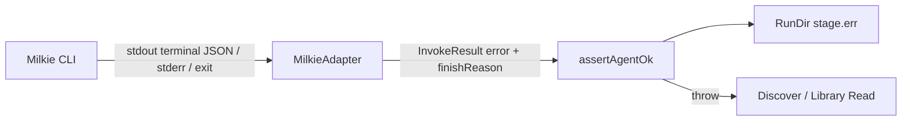

# 【adapter】消费 Milkie 终态错误契约

- Issue: #116
- 状态: Implemented
- 最后更新: 2026-07-31

## 1. 背景

Researcher 的 `MilkieAdapter` 目前只用子进程 exit code 判定失败，并从 stdout 最后一行读取 output 和 runId。旧 Milkie 可返回 terminal `status: 'error'` 却 exit 0；Researcher 会继续执行，最终仅以产物缺失或通用错误失败，丢失上游的错误码、消息和 finish reason。Milkie #219/#220 将分别修复工具参数语义和 CLI 失败信号；本设计规定 Researcher 的防御性消费与失败产物。

## 2. 名词解释

- **terminal result**：Milkie CLI stdout 最后一条 run 结果 JSON，包含 runId、status、lastOutput 与可选 error。
- **规范化失败**：adapter 将 terminal `status:error` 或非零退出统一映射为失败的 `InvokeResult`。
- **failure artifact**：`<stage>.err`，供用户在不读取 Milkie JSONL 时定位失败。

## 3. 设计目标与非目标

- **目标**：解析 terminal result；兼容新旧 Milkie 的 error status/exit code；将结构化错误和 finish reason 写入 failure artifact；使 pipeline 在首次 agent failure 处停止。
- **非目标**：不复制 Milkie 的 arguments parser、工具 schema 或 retry 策略；不修改 Discover 上下文分段；不要求所有 adapter 提供 Milkie 字段。

## 4. 能力与功能设计

### 4.1 UI / UX

N/A：CLI 用户通过现有错误路径打开 `<stage>.err`；文件头提供短错误摘要，尾部继续保留 stderr/stdout 证据。

## 5. 设计思路与折衷

`MilkieAdapter` 解析 terminal JSON 一次，派生 output/runId/status/error。若进程非零或 status error，均返回 `InvokeResult.exitCode !== 0`；这同时消费 #220 的强信号并防御旧版 Milkie。`InvokeResult` 增加可选结构化 `error`，不让 pipeline 解析 stdout 格式。`RunDir.recordAgentFailure` 把 error code/message/finish reason 写在 artifact 头部。仅依赖 #220 的 exit code 会让版本漂移重新隐藏失败；在每个 pipeline 中解析 stdout 会扩大耦合。

## 6. 架构设计

### 6.1 逻辑分层



Adapter 是唯一了解 Milkie stdout contract 的边界。Runner 只依据规范化 `InvokeResult`；pipeline 无需感知 CLI 版本。

### 6.2 核心业务流程

1. Adapter 运行 CLI，读取 stdout terminal JSON 和 runId。
2. Adapter 从 JSONL 取得最后一个 finish reason（若 trace 可用）。
3. 若 terminal status error 或 exit 非零，规范化 exit code、错误摘要和 optional structure。
4. `assertAgentOk()` 调用 `recordAgentFailure()` 后抛出指向 artifact 的错误。
5. Discover 不进入 length recovery；Library Read 不继续内容校验。

## 7. 模块设计

- `src/adapter/interface.ts`：定义可选 `InvokeError` 与 `InvokeResult.error`。
- `src/adapter/milkie.ts`：terminal parser、exit/status 规范化和 error 映射。
- `src/state/runs.ts`：failure artifact 首部包含 finishReason、error code/message。
- `src/pipeline/runner.ts`：继续通过 exit code 统一处理，无 Milkie 特化。
- `tests/adapter/milkie.test.ts`、`tests/state/runs.test.ts`、`tests/pipeline/*`：覆盖新旧状态与 fail-fast。

## 8. API / CLI 设计

内部 adapter 契约追加兼容字段：

```ts
interface InvokeError {
  code?: string;
  message: string;
  details?: unknown;
}

interface InvokeResult {
  // existing fields
  error?: InvokeError;
}
```

`error` 仅在 adapter 可以安全提取时存在；非 Milkie adapter 不受影响。terminal status error 的规范化 exit code 为 1，保留真实非零 exit code。

## 9. 边界考虑

- **兼容**：completed stdout 和 `FILES_MODIFIED` 解析保持不变；旧 terminal JSON 缺字段时沿用现有行为。
- **诊断**：artifact 记录脱敏 code/message；stdout/stderr tail 继续保留。
- **优先级**：显式 terminal error 优先于模糊 stderr 文本；finish reason 仅作附加诊断。
- **恢复**：上游 terminal error 不是缺文件的可恢复 length，必须 fail-fast。
- **安全**：不把原始 tool arguments 复制进 Researcher 状态目录。

## 10. 迁移 / 兼容 / 回滚

- 无持久化迁移；`InvokeResult.error` 可选。
- 与未升级 Milkie 兼容：status error + exit 0 仍规范化失败。
- 回滚仅移除额外摘要；历史 `.err` 文件不需迁移。

## 11. 测试计划

- **E2E**：使用包含 #219/#220 的 Milkie，令 agent 以 terminal error 结束；Researcher CLI 失败且 `.err` 包含 code/finish reason，不写成功阶段 marker。
- **Integration**：mock execa 返回 terminal error 的 exit 0/1，两者都 fail；completed 输出和 modified files 不变。
- **Unit**：terminal JSON parser、error message 优先级和 failure artifact 格式。

## 12. 开放问题 / 决策记录

- 决策：adapter 对 terminal status error 做向后兼容的 exit 1 规范化，即使 #220 尚未升级。
- 决策：`details` 保持 opaque，避免 Researcher 将上游错误 schema 固化为公开 API。

## 13. 关联

- Issue #116
- Milkie #219
- Milkie #220
- Researcher #117
