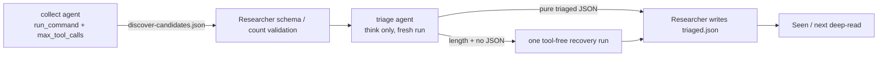

# 【pipeline】Discover 搜集与分诊的上下文隔离

- Issue: #117
- 状态: Implemented
- 最后更新: 2026-07-31

## 1. 背景

Discover 当前用一个可执行 `run_command` 的 agent run 完成检索、筛选和 `triaged.json` 落盘。工具输出与推理历史在同一上下文中累计，已观测到输入从约 5.5k 增至约 39.5k tokens，而单轮输出反复截断于 4096 tokens。PR #110 只在缺少最终文件后进行一次 recovery，无法隔离上下文或强制限制搜集阶段的工具调用。

## 2. 名词解释

- **collect run**：可使用受预算工具的独立 agent run，仅生成候选交接文件。
- **triage run**：无工具的独立 agent run，仅将紧凑候选分诊为最终 JSON 文本。
- **交接文件**：run-local `discover-candidates.json`，经 schema 校验后是 triage 的唯一候选来源。
- **tool-call budget**：Milkie 在 Runtime dispatch 前强制的每 run 最大工具调用次数。

## 3. 设计目标与非目标

- **目标**：
  - collect 与 triage 使用不同 agent id、不同 run 和不同上下文。
  - collect 的 tool-call budget 由 Milkie 运行时强制；达到上限后不再执行 handler。
  - triage/recovery 没有 `run_command`，只返回纯 JSON；宿主校验并写入最终文件。
  - 保持外部 stage 名称 `discover`、triaged schema 和下游 Seen 更新语义。
- **非目标**：
  - 不建设任意子代理协商框架。
  - 不改变候选的学术筛选标准或长期状态结构。
  - 不仅通过加大 token 限额规避上下文增长。

## 4. 能力与功能设计

### 4.1 UI / UX

N/A：无新增页面。CLI 用户仍看到一个 `discover` stage；失败 artifact 说明 collect/triage/recovery 的失败点。

## 5. 设计思路与折衷

选择文件交接而非同一 agent 内自我摘要：新 invocation 才能物理丢弃先前工具 trace。collect agent 保留 `run_command` 以获取候选，但其 frontmatter 指定 `max_tool_calls`。Milkie Runtime 执行预算门禁，而不是用 `max_iterations` 近似，避免单个 LLM 响应并行发多条工具调用绕过预算。triage agent 只注册 `think`，它返回纯 JSON，Researcher 宿主调用 `parseTriaged` 后写文件；因此不能进行网络/PDF/文件工具调用。放弃让 triage 使用 `run_command` 写文件，因为 prompt 禁令不能防止副作用。

## 6. 架构设计

### 6.1 逻辑分层



Milkie 负责工具预算原子门禁；Researcher 负责 agent 选择、artifact schema、JSON 写入和下游业务状态。#116 负责把 terminal error 正确传回该 pipeline。

### 6.2 核心业务流程

1. 若不存在有效交接文件，运行 collect agent；其工具调用超过预算时由 Milkie 拒绝，agent 可写已有候选或结束。
2. 宿主解析 `discover-candidates.json`，去重并限制候选数；无候选是合法文件。
3. 运行 triage agent，新 prompt 仅包含项目摘要、seen/landscape 摘要与候选文件内容；agent 无 tools。
4. 宿主要求并解析纯 `triaged.json` 文本，成功后写 run-local 文件并应用现有 Seen/选题逻辑。
5. 仅 triage 以 `length` 结束且没有可解析 JSON 时，执行一次工具禁用的 recovery；失败则记录阶段错误。

## 7. 模块设计

### Milkie（关联 #117 PR）

- agent frontmatter schema 新增 optional `max_tool_calls`。
- Runtime 在每次 tool dispatch 前原子计数；超限时不执行 handler，返回可诊断 `TOOL_CALL_BUDGET_EXCEEDED` ToolResult/trace。

### Researcher

- `templates/milkie-agents.json` 注册 collect 与 triage agent。
- `templates/milkie-researcher-collect.md`：`run_command`、固定 budget、只写 candidates artifact。
- `templates/milkie-researcher-triage.md`：仅 `think`、输出纯 JSON。
- `src/config/discover-candidates.ts`：候选交接 zod schema 和 parser。
- `src/pipeline/discover_triage.ts`：内部拆为 collect、validate、triage、single recovery、应用分诊；exported entrypoint 不变。
- `src/adapter/interface.ts`、`src/adapter/milkie.ts`：每次 invoke 选择 agent id；#116 的 terminal error 仍由 adapter 规范化。

## 8. API / CLI 设计

Milkie agent frontmatter：

```yaml
fsm:
  max_tool_calls: 12
```

- 缺省表示无限制，保持现有 agent 行为。
- `0` 禁止全部工具调用；triage 使用工具列表为空/仅 think，不依赖 0 的副作用。
- 达到预算的调用返回 `TOOL_CALL_BUDGET_EXCEEDED`，不调用 handler。

Researcher 新增 run artifact：

```json
{
  "candidates": [{"id":"arxiv:...","title":"...","url":"...","abstract":"...","source":"arxiv"}],
  "search_summary":"..."
}
```

候选字段以现有 Triaged candidate 可安全映射的最小集为准；最终 `triaged.json` schema 不变。

## 9. 边界考虑

- **预算**：Runtime 在 dispatch 前检查，parallel tool calls 必须共享同一原子计数；被拒绝调用的 handler 执行次数为 0。
- **上下文**：triage prompt 不含 collect 输出历史、完整工具 stdout 或 runtime trace；仅含已验证的交接内容。
- **恢复**：collect 的 partial artifact 必须合法；triage 只 recovery 一次；非 length error fail-fast。
- **安全**：collect 继续将外部文本视为不可信；triage 不可执行工具。
- **兼容**：对外 stage/CLI 语义、triaged 文件和 Seen 行为不变；旧 run 无需迁移。

## 10. 迁移 / 兼容 / 回滚

- 模板升级后新项目安装包含两个 agent；已初始化项目在 package/methodology 更新时获得模板覆盖策略定义的迁移。
- 无 `max_tool_calls` 的既有 Milkie agents 继续无限制运行。
- 回滚可恢复单 agent prompt，但保留历史 run-local artifacts；不影响长期 seen state。

## 11. 测试计划

- **E2E**：确定性 fake provider 驱动 collect 直到预算；额外 handler 调用为 0，写出合法 candidates；独立 tool-free triage 生成 `triaged.json`；triage length 最多执行一次 recovery。
- **Integration**：Milkie parallel/serial tool calls 共用预算；Researcher collect/triage 使用不同 agent id 和 runId，triage trace 无 tool.requested 事件。
- **Unit**：candidates parser 的非法/重复/数量边界；prompt 只包含紧凑交接；无效 triage JSON 不写最终文件。

## 12. 开放问题 / 决策记录

- 决策：`max_tool_calls` 默认 undefined 代表兼容无限制；Researcher collect 显式设为 12。
- 决策：triage 由宿主写文件，换取运行时可验证的零工具副作用。
- 决策：不新增第五个外部 issue；Milkie budget PR 链接 Researcher #117，作为该 issue 的跨仓库依赖实现。

## 13. 关联

- Issue #117
- Researcher #116
- Milkie #219
- Milkie #220
- PR #110
