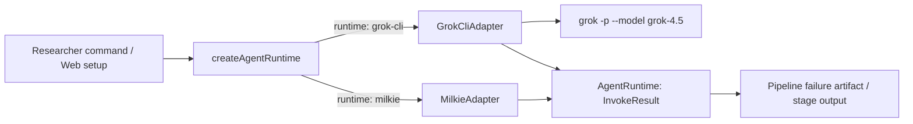

# 【AgentProvider】Grok CLI 执行 Provider

- Issue: #120
- 状态: Implemented
- 最后更新: 2026-07-31

## 1. 背景

Researcher 的 agent stages 当前在各 command 中直接实例化 `MilkieAdapter`。将模型名写为 `grok4.5` 仍会走 Milkie 的 OpenAI-compatible Coding Plan 路径，实际被网关拒绝。已认证的本机 Grok CLI 则能以 `grok -p --model grok-4.5` 完成单轮调用。本设计为已有 `AgentRuntime` 增加一个外部 CLI provider，并以全局配置集中选择 provider，避免各 command 自行处理子进程和错误。

## 2. 名词解释

- **AgentProvider**：实现 `AgentRuntime` 的运行时，接收 Researcher 组合的 system/user prompt，返回统一 `InvokeResult`。
- **Grok CLI**：本机 `grok` 可执行文件；本设计仅使用其 headless 单轮入口 `-p`。
- **runtime 配置**：`$RESEARCHER_HOME/config.yaml` 中选择 agent provider 的全局配置；未显式设置时保持 Milkie。

## 3. 设计目标与非目标

- **目标**：支持 `runtime: grok-cli`；用 `grok -p` 执行 Researcher agent stages；成功与失败均遵守现有 `InvokeResult` 和 failure artifact 契约；默认 Grok 模型为 `grok-4.5`。
- **非目标**：Grok TUI、会话恢复、多轮上下文、工具调用转译、凭证配置、library-read 的 `OpenAITextAdapter`，以及变更 Milkie 默认 runtime。

## 4. 能力与功能设计

### 4.1 UI / UX

N/A。配置经 YAML 和现有 CLI/Web 所触发的 agent stages 生效，不新增页面。

### 4.2 配置与调用

`$RESEARCHER_HOME/config.yaml` 扩展为：

```yaml
runtime: grok-cli
runtime_options:
  grok-cli:
    bin: grok
    model: grok-4.5
```

`runtime` 缺失时为 `milkie`。`runtime_options.grok-cli` 缺失时使用上述 `bin` 和 `model` 默认值。Grok provider 将 system prompt 和 user prompt 编成一个单一文本，并执行：

```text
grok -p <combined-prompt> --model <model> --no-plan --no-memory
```

`agentId` 不传给 Grok，因为 `grok -p` 没有 Milkie agent-definition 语义。成功时 stdout 是 `output`、`exitCode` 为 0、`modifiedFiles` 为空。provider 不解析 stdout 中的文件声明。

## 5. 设计思路与折衷

候选方案：

1. 继续经 Milkie 使用 Grok 模型名：放弃，Coding Plan 网关已拒绝该模型。
2. 每个 command 直接调用 `grok -p`：放弃，timeout、错误与结果会分叉，且难以在测试中替换。
3. 新增 `GrokCliAdapter` 并通过 factory 集中选择：选择。它复用 `AgentRuntime`，保留 Milkie 回退，且可用临时 CLI 替身确定性验证参数与错误。

Grok provider 固定 `--no-plan --no-memory`。这是单轮 stage 的最小语义，避免计划模式或跨运行记忆污染独立的 Researcher stages。

## 6. 架构设计

### 6.1 逻辑分层



`GlobalConfig` 解析 runtime 与 per-runtime option。`createAgentRuntime` 是唯一生产选择点。`run`、`add`、`read`、`onboard` 与 topic setup 使用 factory；library-read 继续独立使用 `OpenAITextAdapter`。

### 6.2 核心业务流程

1. command 从 `RESEARCHER_HOME/config.yaml` 读取 runtime。
2. factory 返回 `MilkieAdapter` 或 `GrokCliAdapter`；未知 runtime 在解析配置阶段失败。
3. Grok adapter 创建一条 combined prompt，启动一个 CLI 子进程。
4. exit 0 返回 stdout；命令缺失、超时、非零退出返回 exit 1、保留 stderr 并写入安全错误代码。
5. 既有 `assertAgentOk` 将失败写进 `<stage>.err` 后停止 stage；不进入成功或伪恢复路径。

## 7. 模块设计

- `src/config/global-config.ts`：扩展 runtime schema 与 Grok options。
- `src/adapter/grok-cli.ts`：唯一负责 prompt 编码、`execa` 调用与错误映射。
- `src/adapter/runtime.ts`：基于全局配置构造 AgentRuntime。
- 生产 command/topic setup：移除直接 `new MilkieAdapter()` 默认值，改用 factory；显式测试注入不变。

## 8. API / CLI 设计

不新增 Researcher 对外 CLI 参数。配置契约如下：

| 字段 | 取值 | 默认 | 失败 |
|---|---|---|---|
| `runtime` | `milkie` / `grok-cli` | `milkie` | 非枚举值配置解析失败 |
| `runtime_options.grok-cli.bin` | 非空路径/命令名 | `grok` | 缺失可执行文件返回 `GROK_CLI_NOT_FOUND` |
| `runtime_options.grok-cli.model` | 非空模型 ID | `grok-4.5` | CLI 非零退出返回 `GROK_CLI_EXIT` |

超时返回 `GROK_CLI_TIMEOUT`。所有错误 message 只包含命令结果摘要，不包含环境变量或凭证。

## 9. 边界考虑

- `execa` 使用 argv 数组而非 shell，prompt 不经过 shell 插值。
- timeout 取现有 `InvokeOptions.timeoutMs`，默认 30 分钟；超时子进程由 `execa` 终止。
- stderr 被保留给 RunDir failure artifact；stdout 仅在成功时作为输出，失败时输出为安全错误摘要。
- 配置文件不存储 API key；Grok CLI 负责其自身认证。
- 单轮调用不接受/恢复 context ID，避免相邻 Researcher stages 共享未声明记忆。

## 10. 迁移 / 兼容 / 回滚

未配置用户继续为 `milkie`，无迁移。当前 `agentic-model-training` 通过全局配置切到 `grok-cli`；其 Milkie agent definition 恢复为 `glm-latest`，以便日后切回 Milkie 时仍有有效模型。回滚仅删除或将 `runtime` 设回 `milkie`，无需数据迁移。

## 11. 测试计划

- **E2E**：临时可执行 Grok 替身接收 argv，断言一次 `-p`、`--model grok-4.5`、`--no-plan` 与 `--no-memory`，并返回非空 stdout；真实已认证环境运行一次 `grok -p --model grok-4.5`，观察非空响应。
- **Integration**：`run` 在 `runtime: grok-cli` 时通过 factory 进入 adapter，失败写出 `discover.err`。
- **Unit**：config 默认/显式选择；成功、缺少可执行文件、timeout、非零退出的 InvokeResult 语义。

## 12. 开放问题 / 决策记录

N/A。`grok-4.5` 已由 `grok models` 与直接单轮探测验证可用。

## 13. 关联

- Issue #120
- L1 概要：https://github.com/xforce-io/researcher/issues/120#issuecomment-5141408187
- PR：待创建
- 相关模块：`src/adapter/`、`src/config/global-config.ts`、`src/commands/`
