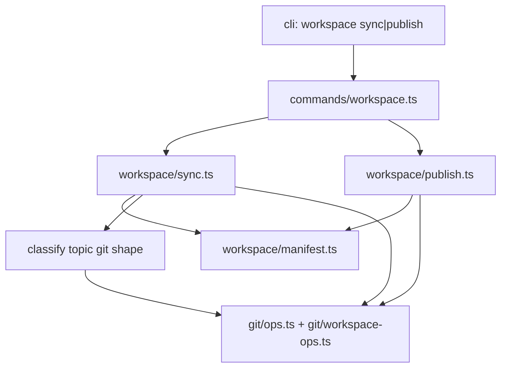

# 【workspace】显式 workspace sync 对齐 GitHub

- Issue: #130
- 状态: Approved
- 最后更新: 2026-08-01

## 1. 背景

Workspace 超级仓有两层 git：各 topic 子仓 + super-repo 的 submodule 指针。今天只有 topic 层的 `delivery.mode: remote`（挂在单次 `run`/package 末尾的 push + draft PR），没有显式的 workspace 级同步命令。

结果：

- 有 `origin` 的 pillar 默认仍可能是 local 投递，人要自己 push。
- 纯本地 pillar（未进 `.gitmodules`、无 remote）无法晋升为远程成员。
- super-repo 指针 bump 只能人肉。

`docs/design/9-workspace-run.md` 已将 pointer sync 标为未来显式步骤（possibly `researcher workspace sync`）。本设计兑现该步骤，并补齐 pull / push-topics / publish。

## 2. 名词解释

- **Topic delivery**：`.researcher/project.yaml` 的 `delivery.mode`；仅影响 package 是否 push+开 PR。
- **Workspace sync**：超级仓根的显式运维动作，对齐各 topic 与 super-repo 的 git 状态；**不**改 `delivery.mode`。
- **Publish**：把「本地 git 目录 + manifest 条目」晋升为「有 origin 的 submodule 成员」。
- **Pointer / gitlink**：super-repo 中记录的 submodule commit SHA。

## 3. 设计目标与非目标

- **目标**：
  - CLI：`researcher workspace sync` 与 `researcher workspace publish`
  - 可组合：`--pull` / `--push-topics` / `--pointers`；可 `--dry-run`；默认同 active topics，`--all` 含 dormant
  - 与 `delivery.mode` 正交
  - 单 topic 失败隔离；摘要可判定；exit code 反映是否存在 failed
- **非目标**：
  - 不改 `run` / package 默认自动 bump super-repo
  - 不做非 ff merge / rebase / force push
  - 不 `gh repo create`、不管理多 remote
  - 不在 `serve` 暴露 UI
  - push-topics **不开 PR**（PR 仍归 delivery remote 路径）

## 4. 能力与功能设计

### 4.1 UI / UX

N/A：无 Web 页面。CLI 人类可读摘要表 + 非零 exit 表示存在 failed。

用户主路径：

```text
cd <workspace-root>
researcher workspace sync --pull
researcher workspace sync --push-topics
researcher workspace sync --pointers
researcher workspace publish world-model --remote git@github.com:org/repo.git
researcher workspace sync --pull --push-topics --pointers --dry-run
```

## 5. 设计思路与折衷

候选：

1. **每次 workspace `run` 末自动 sync** — 实现省事，但污染 super-repo、与 local 探索冲突。
2. **仅文档 + 人肉 git** — 零代码，但与「一个根推进」不一致，且易漏 pointer。
3. **显式 `workspace sync` / `publish`（采纳）** — 运维意图清晰、可 dry-run、可测；与 delivery 正交。

放弃 1/2：自动副作用过大；纯文档无法验收。

`publish` 与 `sync --pointers` 拆开：前者改变拓扑（remote + submodule 登记），后者只 bump 已有 gitlink。避免 `sync` 隐式 `submodule add`。

## 6. 架构设计

### 6.1 逻辑分层



- `manifest`：谁在 workspace、active/dormant
- `classify`：missing / not-git / local-only / remote / submodule
- `git ops`：ff-pull、push 当前分支、读 origin、读 HEAD、stage gitlink、commit super-repo、submodule 登记
- sync/publish：**串行**、收集 per-topic 结果，最后打印 summary

### 6.2 核心业务流程

**sync**

1. 校验 cwd 有 `researcher.workspace.yml`，否则 exit 2 类用法错误
2. 解析 flags：未指定任何动作时默认 `--pull`（只读安全默认）
3. 选题：active；若 `--all` 则全部 manifest topics
4. 对每个 topic 分类后按启用的动作执行：
   - pull：有 origin 则 `fetch` + 当前分支 `pull --ff-only`；否则 skipped
   - push-topics：有 origin 则 `push -u origin HEAD`；否则 skipped
   - pointers：仅 submodule 且 gitlink≠HEAD 时 stage path；循环后若有 staged 则 super-repo 一次 commit
5. dry-run：只报告 will-*，不 exec 写操作
6. 任一 `failed` → process exit 1；纯 skipped/ok → 0

**publish `<path>`**

1. path 必须在 manifest；目录存在且为 git 仓
2. 若已是 submodule 或已有 origin → 明确错误（非静默）
3. `git remote add origin <url>` → push 当前分支
4. 在 super-repo：用安全方式登记 submodule（见 §9，避免 `git submodule add` 要求空目录）
5. 不修改 topic 的 `delivery.mode`

## 7. 模块设计

| 模块 | 职责 |
|---|---|
| `src/commands/workspace.ts` | CLI 参数、cwd 解析、exit code、打印 |
| `src/workspace/sync.ts` | sync 编排、结果类型、summary |
| `src/workspace/publish.ts` | publish 编排 |
| `src/workspace/topic-git.ts` | 分类 topic：missing/not-git/local-only/remote/submodule |
| `src/git/ops.ts` 或 `src/git/workspace-ops.ts` | 新增：hasOrigin、getRemoteUrl、fetch、pushHead、isSubmodulePath、stageGitlink、commitPointers、registerSubmodule |
| `tests/workspace/sync.test.ts` 等 | fixture + 行为断言 |

复用：`loadWorkspaceManifest` / `activeTopics`；既有 `pullFastForward` / `pushBranch` 可包一层「强制 remote=true」或抽无 gate 的底层实现，避免 sync 误走 delivery 语义。

## 8. API / CLI 设计

```text
researcher workspace sync [options]
  --pull              fetch + ff-only 当前分支（默认：若无任何动作 flag 则启用）
  --push-topics       push 当前分支到 origin
  --pointers          bump super-repo 中已有 submodule 的 gitlink 并 commit
  --all               包含 dormant topics（默认仅 active）
  --dry-run           不写：不 push / 不 commit / 不改 gitmodules
  --cwd <path>        可选，默认 process.cwd()

researcher workspace publish <path> --remote <git-url> [options]
  --remote <url>      必填 origin URL（调用方已建好空仓）
  --dry-run
  --cwd <path>
```

成功摘要示例（stdout）：

```text
workspace sync
  trace                   pull=ok      push=ok      kind=submodule
  decision                pull=skipped push=skipped kind=local-only (no origin)
  ghost                   pull=failed  reason=missing directory
pointers: committed 1 gitlink(s)  # 或 dry-run / no-op
```

Exit：

- `0`：无 failed（skipped 允许）
- `1`：至少一个 failed
- `2`：用法/非 workspace 根

## 9. 边界考虑

- **假设**：topic 是独立 git 仓或正规 submodule；super-repo 本身是 git 仓（pointers/publish 需要）
- **错误**：非 workspace、publish 缺 remote、path 不在 manifest、已有 origin、非 ff → 明确消息
- **并发**：不做；串行同 orchestrator
- **权限/安全**：不执行任意 shell；remote URL 原样交给 git；不打印 token
- **submodule 登记**：目录已存在时不能直接 `git submodule add <url> <path>`。采用：
  1. 确保 topic 已 push 到 origin
  2. 写/更新 `.gitmodules` 段
  3. `git update-index --add --cacheinfo 160000 <sha> <path>`（或等价）写入 gitlink
  4. super-repo commit（publish 自己的 commit message，与 pointers 分开）
- **dirty tree**：pull/push 不自动 stash；git 失败则该 topic failed
- **detached HEAD**：push-topics failed（需具名分支）；pull 可对 detached 尝试 ff 当前 HEAD 的上游，若无上游则 skipped/failed 并说明

## 10. 迁移 / 兼容 / 回滚

- 纯新增命令；无配置迁移
- 不改变既有 `run` / `delivery.mode` 行为
- 回滚：移除命令即可；已 publish 的 submodule 保留为用户 git 状态

## 11. 测试计划

- **E2E / Integration**（`tests/workspace/sync.test.ts`、`publish.test.ts`）：
  1. 建临时 super-repo + bare remotes
  2. topic A：submodule + origin，远程快进 → pull ok
  3. topic B：local-only → pull/push skipped
  4. topic A 本地超前 → push-topics 后 bare 有新 tip
  5. 子仓前进后 `--pointers` 产生 1 个 super commit；`--dry-run` 不产生
  6. local-only topic → `publish --remote <bare>` 后有 origin、`.gitmodules` 含 path、super 有 gitlink
  7. 故意失败 topic + 成功 topic → 摘要隔离，exit 1
- **Unit**：
  - classify 四种形态
  - flag 默认（无动作 → pull）
  - exit code 聚合（failed vs skipped）

## 12. 开放问题 / 决策记录

- 无动作 flag 时默认 `--pull`：只读安全，避免裸 `sync` 误 push。
- push 不开 PR：保持 delivery 为唯一自动 PR 入口。
- publish 不建 GitHub 仓：避免 `gh` 权限与 org 策略耦合。

## 13. 关联

- Issue #130
- L1：issue comment「设计（概要）」
- 前作：`docs/design/9-workspace-run.md`
- 模块：`src/workspace/*`、`src/git/ops.ts`、`src/cli.ts`
