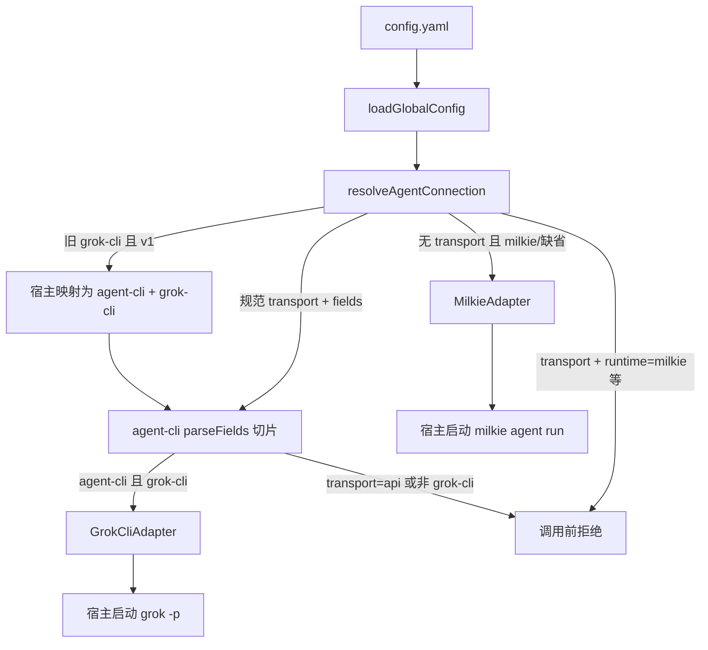

# 【runtime】仅 grok-cli 对齐 milkie agent-cli 契约

- Issue: #147
- 状态: Implemented
- 最后更新: 2026-08-22

## 1. 背景

[#147](https://github.com/xforce-io/researcher/issues/147)。milkie #251 / PR #252 已合进 milkie `main`：`transport` 为 `api | agent-cli`，`agent-cli` 的 `runtime` 闭集为 `claude-code | grok-cli | codex`。契约不启动 CLI，不接管 Researcher 编排。

Researcher 现网顶层 `runtime: milkie | grok-cli` 把「本仓 `milkie agent run` 编排器」和「Grok CLI」塞进同一个枚举。`milkie` 不在契约闭集中。L1（方案 A）已在 issue comment 批准：只有 `grok-cli` 走契约；`milkie` 留在宿主层。

## 2. 名词解释

- **宿主编排器**：`MilkieAdapter` 子进程 `milkie agent run`。不是契约 `runtime`，也不是新 `transport`。
- **契约连接**：milkie `resolveAndParseConnection` 的规范字段。本 issue 只在选 Grok CLI 时调用，且只用入口 B（`fields`）。
- **旧顶层 runtime**：仅有 `runtime: milkie|grok-cli`、无 `transport` 的现网 yaml。

## 3. 设计目标与非目标

- **目标**：
  - 无 `transport` 且未声明或 `runtime: milkie` → `MilkieAdapter`，不调用契约 parse。
  - 规范 `transport: agent-cli` + `runtime: grok-cli` → 契约 parse 成功后 `GrokCliAdapter`。
  - 旧 `runtime: grok-cli`（无 `transport`）在 `contractVersion=1` 映射为上述规范字段再 parse。
  - `transport=api`、契约位置上的 `milkie` / `claude-code` / `codex`、以及 `protocol` / `apiKey` / `baseUrl` 出现在 agent 配置时，在 `createAgentRuntime()` 前拒绝。
- **非目标**：改 milkie 闭集；实现 Claude/Codex adapter；`assembleApiGateway` / 进程内 `createGateway`；改 Grok CLI argv；library-read HTTP 契约化；入口 A 环境前缀（`RESEARCHER_LLM_*`）作为本 issue 事实源。

## 4. 能力与功能设计

N/A：无新用户可见阶段。行为只经 `$RESEARCHER_HOME/config.yaml` 与既有 agent 命令。

### 4.1 UI / UX

N/A。错态为调用前抛出；优先透出 milkie `ConnectionConfigError` 的 `code` + `fields`。无 adapter 的契约合法值（`claude-code` / `codex`）同样在 factory 拒绝，不启动进程。

## 5. 设计思路与折衷

- **选择**：yaml 为事实源；Grok 路径按 milkie `parseFields` 的 agent-cli 规则校验（同一 `code` / `fields` / 安全文案）。发布包 `@freemanxu/milkie@0.1.1` 的 dist **未导出** `resolveAndParseConnection`，故本 issue 不依赖该 helper；待导出后再改为入口 B 直调。放弃另造一套枚举名。
- **选择**：`milkie` 根本不进 `fields.runtime`。放弃 `runtime=milkie` 写入契约，也放弃 `transport=milkie`。
- **选择**：契约 parse 成功但 `transport=api`，或 `runtime` 为 `claude-code|codex`，由 **宿主** 再拒绝。契约允许这些值；本仓没有对应 agent adapter，且禁止装配 HTTP gateway。
- **放弃**：本 issue 收集 `RESEARCHER_LLM_*`。入口 A 与 yaml 双源会引入 milkie 已禁止的双入口冲突；需要时另开。
- **迁移**：旧 grok-cli 是 **宿主** 映射到规范 `fields`，不是 milkie HTTP `legacyModelConfig` 表。旧 milkie 不映射为 `agent-cli`。`contract_version >= 2` 时旧 grok-cli（无 `transport`）按 `CONNECTION_CONFIG_LEGACY_EXPIRED` 拒绝。

## 6. 架构设计

### 6.1 逻辑分层



依赖：不升 milkie；npm `0.1.1` 尚未导出连接 helper。library-read 仍直接 `new OpenAITextAdapter()`。

### 6.2 核心业务流程

1. `createAgentRuntime(home)` 读 `home/config.yaml`（缺省文件 = 宿主编排器）。
2. 无 `transport`：
   - `runtime` 缺省或 `milkie` → `MilkieAdapter`，**不** parse。
   - `runtime=grok-cli` 且 version≥2 → `LEGACY_EXPIRED`。
   - `runtime=grok-cli` 且 version=1 → 映射 `fields={transport:agent-cli, runtime:grok-cli, model?}` 后 parse。
   - 其它 `runtime` → `UNKNOWN_VALUE`。
3. 有 `transport`：把 yaml 中出现的契约字段送入同一套 agent-cli 校验。`runtime=milkie` 为 `UNKNOWN_VALUE`。
4. 校验通过后：仅 `transport=agent-cli` 且 `runtime=grok-cli` 可构造 `GrokCliAdapter`（bin/model 仍来自 `runtime_options.grok-cli`）。`api` 或其它 runtime 拒绝；永不装配 HTTP gateway。
5. library-read 不经过本 factory。

## 7. 模块设计

- `src/config/global-config.ts`：yaml 形状（可选 `transport` / 契约字段 / `contract_version`；保留 `runtime_options.grok-cli`）。
- `src/config/agent-connection.ts`（新）：宿主映射 + milkie `parseFields` 切片 + 本仓 adapter 资格。
- `src/adapter/runtime.ts`：只用 resolve 结果实例化 `MilkieAdapter` | `GrokCliAdapter`。
- 不改 `MilkieAdapter` / `GrokCliAdapter` / `OpenAITextAdapter` 的 invoke 语义。

## 8. API / CLI 设计

配置文件：`$RESEARCHER_HOME/config.yaml`。

```yaml
# 宿主编排器（缺省；不经契约）
runtime: milkie

# 规范 grok-cli
transport: agent-cli
runtime: grok-cli
runtime_options:
  grok-cli:
    bin: grok
    model: grok-4.5

# 窗口内旧 grok-cli（无 transport）
runtime: grok-cli
```

- 成功：`createAgentRuntime()` 返回 `id=milkie|grok-cli`。
- 失败：抛出 `AgentConnectionError`，`code` / `fields` / 文案与 milkie 连接错误对齐；发生在任何模型/CLI 子进程之前。
- 兼容：缺省文件与旧 `runtime: milkie` 行为不变；旧 `runtime: grok-cli` 仅 v1 窗口有效。
- `contract_version` 可选，缺省 `1`。

## 9. 边界考虑

- 假设：校验规则与 milkie `main` 的 `parseFields` 闭集一致。当前 npm `0.1.1` 未带 connection 模块，不 import helper。
- 错误：非法枚举、缺 `runtime`（在有 `transport` 时）、`agent-cli` 带 `protocol`/`apiKey`/`baseUrl`、双含义 `transport`+宿主 `milkie`，均 fail-closed，不回退 milkie。
- 并发 / 幂等：N/A（读配置，无写）。
- 权限：agent-cli 路径不读 apiKey；若 yaml 出现 apiKey 只用于拒绝，不得写入日志 / run 摘要。
- 性能：一次同步 parse，无网络。
- 安全：不把 key 或完整 base URL 打进错误 message 以外的宿主投影；沿用 milkie 安全文案。

## 10. 迁移 / 兼容 / 回滚

- 旧 `runtime: milkie`：无迁移，仍是宿主编排器。
- 旧 `runtime: grok-cli`：v1 映射到契约 grok-cli；v2 起须显式 `transport: agent-cli`。
- 回滚：还原 factory 与 schema；现网两种旧 yaml 仍合法。
- 不改 topic 仓、不改 library-read 存数。

## 11. 测试计划

- **E2E**：默认 CI 不跑真实 grok / milkie agent。替代：既有 fake bin 的 production runtime 测试覆盖旧 `runtime: grok-cli` 仍执行 `grok -p`；缺省配置仍走 fake milkie。
- **Integration**：`createAgentRuntime()` 对缺省 milkie、规范 grok-cli、旧 grok-cli、`transport=api`、`runtime=claude-code|codex|milkie`（在契约位置）、`protocol` 冲突的成功与抛错。
- **Unit**：yaml schema；旧 milkie 不调用 parse；v2 旧 grok-cli `LEGACY_EXPIRED`；投影成功但不实例化非 grok adapter。

## 12. 开放问题 / 决策记录

- 2026-08-22：方案 A。`milkie` 不是契约 `runtime`，也不是 `transport`。
- 入口 A / `RESEARCHER_LLM_*`：本 issue 不做。
- 未实现的契约 runtime：agent-cli 规则可通过，factory 仍拒绝。
- npm `@freemanxu/milkie@0.1.1` 未导出连接 helper；宿主实现切片，错误码对齐。

## 13. 关联

- Issue #147 · L1 comment · milkie#251 · researcher#120 · researcher#69
