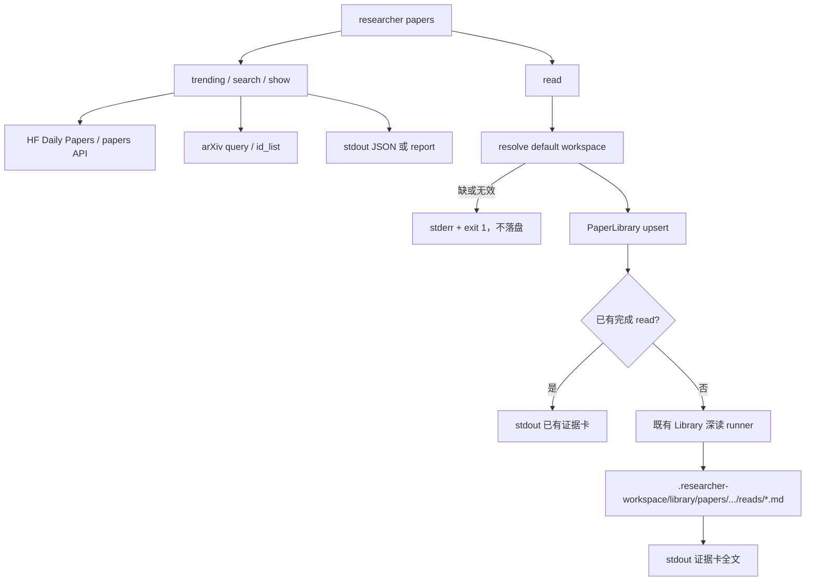

# 【papers】CLI 覆盖热榜 / 查篇 / 深读

- Issue: [#170](https://github.com/xforce-io/researcher/issues/170)
- 状态: Approved
- 最后更新: 2026-09-01
- 分支: `feat/170-papers-cli`

## 1. 背景

[#170](https://github.com/xforce-io/researcher/issues/170)。demo_agent 用独立 `paper-discovery` 做每日热榜和按名/ID 查篇；researcher 的 Library 深读只挂在 web，agent 调不到。L1（方案 A）已在 issue comment 批准：新增 `papers` 子命令组，雷达无工作区，深读写入 [default workspace](../glossary.md) 的 Library，并提供 SKILL.md 供 agent 替换旧推荐路径。

## 2. 名词解释

本设计新增或易混：

- **papers CLI**、**default workspace**、**热榜**：见 [名词表](../glossary.md)。
- **雷达命令**：`trending` / `search` / `show`。无状态，不写 Library。
- **证据卡**：既有 Library 深读产物（#69 / #98），不是 topic `notes/`，也不是摘要扩写。

已有 **Library** / **workspace** / **topic** / **thesis** 只链不抄。

## 3. 目标与非目标

- **目标**：
  - 任意目录可跑热榜、按名搜索、按 arXiv ID 取元数据；`--format json` 为 agent 契约，stdout 不含日志。
  - `papers read` 复用既有 Library 深读 runner，写入 default workspace；已有完成 read 则复用。
  - 仓库提供 SKILL.md：只允许调用本 CLI，禁止 curl/wget/内联抓论文。
- **非目标**：
  - 不把热榜灌进 `run --discover`。
  - 不改现有 `researcher read`（topic `notes/pending/`）。
  - CLI 不写产品落地 / kweaver 评估。
  - 不做多 workspace 切换 UI；不在本仓改 demo_agent HEARTBEAT。
  - 不内嵌 `--with-summary` 一类 everbot LLM 路由。
  - v1 `papers read` 只接受 arXiv ID（URL 深读仍走 web / `library add`）。

## 4. 能力与功能设计

| 能力 | 用户 / agent 看到什么 |
|---|---|
| 热榜 | JSON 列表或中文 report 文本；每篇有稳定 id、title、链接、热度 |
| 搜索 / 展示 | 元数据 JSON；未命中非零退出 |
| 深读 | default Library 多一张完成证据卡；stdout 为卡片全文；`serve` 能打开 |
| Skill | 加载 `skills/papers/SKILL.md` 后只调上述命令 |

### 4.1 UI / UX

N/A。无新页面。`researcher serve` 仍展示既有 Library 证据卡；本 issue 不改 IA。

主路径与空 / 错 / 成功判定见 §6.2，与 Issue S1–S4 一致。

## 5. 思路与折衷

- **选择**：独立 `papers` 组，不挂 `library`。雷达与仓库 CRUD 不是一类操作。放弃 1:1 复制 `fetch_papers.py` 的 flag 堆。
- **选择**：热度排序用 HF Daily Papers 的 upvotes / GitHub stars / 新鲜度（公式见 §8.3）。放弃用 thesis 滤热榜。
- **选择**：深读落盘认全局 default workspace（配置 + 已有 `RESEARCHER_WORKSPACE_ROOT` + 可选 `--workspace`）。放弃「深读必须 cd 进超级仓」。
- **选择**：`papers read` 调用既有 `runLibraryRead`，不新造阅读骨架。放弃在 CLI 里做摘要级「深度解读」。
- **放弃**：热榜自动入库；查询与深读混成单命令；CLI 内产品解读。

## 6. 架构设计

### 6.1 逻辑分层



雷达不读 `researcher.workspace.yml`。深读不经过 topic bootstrap / synthesize / package。

### 6.2 核心业务流程

**雷达（任意 cwd）**

1. 解析 flags；`--format` 缺省 `json`。
2. `trending`：先 HF Daily Papers（`--source huggingface|both`，缺省 `huggingface`）。HF 失败且来源允许 arXiv 时回退 `cat:{category}`（缺省 `cs.AI`）。按热度排序，截断到 `--limit`（缺省 10）。
3. `search`：arXiv `ti:"query"`，最新优先，截断到 `--limit`。
4. `show`：先 HF ` /api/papers/{id}`，失败再 arXiv `id_list`。
5. 成功：stdout 仅 payload。进度与警告在 stderr。
6. 失败：未命中或全部来源失败 → 非零退出，stderr 一句原因；stdout 不写半截 JSON。

**深读**

1. 解析 workspace：`--workspace` > `RESEARCHER_WORKSPACE_ROOT` > `config.yaml` 的 `workspace`。路径必须存在且含 `researcher.workspace.yml`，否则 S4。
2. 规范化 arXiv ID；`library` upsert 该 paper（不创建 topic 链接）。
3. 若该 paper 已有 `status=read` 且证据卡文件存在 → stdout 该文件全文，不调模型。
4. 否则跑既有 Library 深读（15 分钟预算、#98 章节、中文）。进行中状态按现有 runner 写入；失败标记 `failed`，非零退出，不把半截卡当成功。
5. 同一 paper 禁止并行 `papers read`；已有 `reading` 则失败并说明，不另开 runner。
6. stdout 仅为证据卡全文（含既有 frontmatter，与 `serve` 所读文件相同）。路径与阶段信息在 stderr。

## 7. 模块设计

- `src/commands/papers.ts`：子命令入口、stdout/stderr 纪律、退出码。
- `src/sources/hf-daily.ts`（名可在实现时微调）：HF Daily Papers / 单篇 API；失败可判定。
- 热度与 JSON 映射：纯函数，与网络分离，可单测。
- `src/config/global-config.ts`：新增可选 `workspace`（绝对路径字符串）。
- default workspace 解析：一处函数，供 `papers read` 与测试使用。
- `papers read`：编排既有 `PaperLibrary` + `runLibraryRead`；不复制 prompt。
- `skills/papers/SKILL.md`：agent 加载面；列入 npm `files`。
- 不改 `src/commands/read.ts`、discover 种子、web IA。

## 8. API / CLI 设计

```text
researcher papers trending [--limit <n>] [--format json|report]
           [--source huggingface|arxiv|both] [--category <cat>]
researcher papers search <query> [--limit <n>] [--format json|report]
researcher papers show <arxiv-id> [--format json|report]
researcher papers read <arxiv-id> [--workspace <path>]
```

退出码：`0` 成功；`1` 未命中 / 源失败 / 未配 workspace / 深读失败 / 并发 reading。

### 8.1 JSON 契约（`trending` / `search` / `show`）

stdout 为数组（`show` 也是单元素数组）。字段：

| 字段 | 必填 | 说明 |
|---|---|---|
| `id` | 是 | 规范 id，如 `arxiv:2401.12345` |
| `paper_id` | 是 | 无前缀 arXiv id |
| `title` | 是 | 单行标题 |
| `authors` | 是 | 字符串数组，可空 |
| `abstract` | 是 | 全文或源站摘要；不要截断到 500 字（旧脚本的截断不保留） |
| `arxiv_url` | 是 | `https://arxiv.org/abs/{paper_id}` |
| `pdf_url` | 是 | `https://arxiv.org/pdf/{paper_id}` |
| `source` | 是 | `huggingface` \| `arxiv` |
| `published_date` | 是 | `YYYY-MM-DD` 或 `""` |
| `heat_index` | 是 | 0–100 数字 |
| `heat_level` | 是 | 1–5 整数 |
| `upvotes` | 否 | HF |
| `hf_url` | 否 | HF |
| `github_repo` | 否 | URL |
| `github_stars` | 否 | 数字 |
| `ai_summary` | 否 | HF |
| `ai_keywords` | 否 | 字符串数组 |

`report`：中文热榜文本（标题、热度、upvotes/stars、摘要摘录、链接）。不是 agent 契约。

### 8.2 配置

`$RESEARCHER_HOME/config.yaml`（缺省 `~/.researcher/config.yaml`）新增：

```yaml
workspace: /absolute/path/to/super-repo
```

- 可选。缺省文件仍只配 runtime 时，雷达可用，`papers read` 走 S4。
- 必须是绝对路径。相对路径拒绝（避免 agent cwd 漂移写错盘）。
- 解析时校验 `researcher.workspace.yml` 存在。

### 8.3 热度公式

与现网 `paper-discovery` 一致，作为可测契约：

- upvotes：`min(60, ln(upvotes+1)*15)`，无则 0
- GitHub stars：`min(15, ln(stars+1)*3)`，无则 0
- 新鲜度：≤1 天 30；≤3 天 25；≤7 天 20；≤14 天 10；更旧 5；无日期 25
- 来源：huggingface +10；arxiv +5
- `heat_index = min(100, 上述之和)`；`heat_level`：≥80→5，≥60→4，≥40→3，≥20→2，否则 1

## 9. 边界考虑

- 假设：HF Daily Papers 与 arXiv export API 匿名可读；失败可回退或退出，不重试成死循环。arXiv 礼仪沿用既有 `fetchArxivMetadata` 间隔，雷达列表另走短超时（单次请求，不做 8 次长重试）。
- 错误：JSON 模式 stdout 与 stderr 分离。深读失败保留 `PaperRead.status=failed`，不删 paper 元数据。
- 并发：同一 paper 的 `papers read` 互斥（见 §6.2）；热榜无写盘，无锁。
- 权限：不把 API key 写入论文 JSON。HF/arXiv 匿名。
- 性能：热榜/搜索无 LLM。深读与现网 Library 深读同预算。
- 安全：论文正文仍按既有 untrusted 块进入 prompt。

## 10. 迁移 / 兼容 / 回滚

- 现有 CLI 与 `researcher read` 行为不变。
- `config.yaml` 新键可选；旧文件无需迁移。
- npm 包增加 `skills/papers/SKILL.md`；未加载该 skill 的 agent 不受影响。
- 回滚：去掉 `papers` 子命令与配置键即可；已写入 Library 的证据卡保留（与手动 web 深读相同）。
- demo_agent 切换加载面不在本仓；本仓交付 SKILL.md 即满足 S5。

## 11. 测试计划

- **E2E（对 S1–S4）**：
  - S1：非仓库 cwd 跑 `trending --format json --limit 10`，schema 合法、篇数 ≤10；stdout 可 `JSON.parse`。
  - S2：`search` / `show` 命中含 title+abstract+arxiv_url；未命中 exit 1。
  - S3：临时 super-repo + stub runner，`papers read` 写出必选章节；第二次 read 不调 runner。
  - S4：无 `workspace` 配置时 `papers read` exit 1、目标目录无 `.researcher-workspace`。
- **Integration**：HF/arXiv HTTP stub（成功、HF 失败回退 arXiv、双失败、空列表）。
- **Unit**：热度公式、id 规范化、JSON 字段、workspace 解析优先级与相对路径拒绝。
- **S5**：测试或夹具断言 `skills/papers/SKILL.md` 含四个子命令、不含 `fetch_papers.py`。

## 12. 开放问题

N/A。L1 已拍板命令分组、default workspace、深读入库、skill 在本仓交付。

## 13. 关联

- Issue #170；L1 comment（Approved）
- Library 模型 / runner / 章节：#57 / #69 / #98
- discover 不做 trending：#142
- 名词表：`docs/glossary.md`
