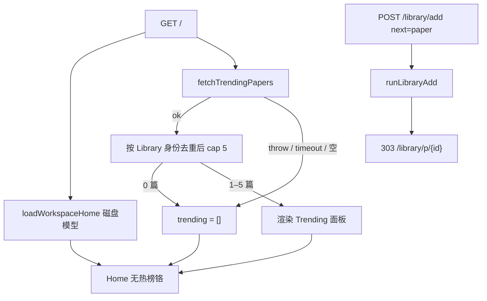

# 【web】首页热榜可入库并打开论文页

- Issue: [#172](https://github.com/xforce-io/researcher/issues/172)
- 状态: Approved
- 最后更新: 2026-09-03
- 分支: `feat/172-home-trending`

## 1. 背景

[#172](https://github.com/xforce-io/researcher/issues/172)。[#170](https://github.com/xforce-io/researcher/issues/170) 把热榜做成 CLI（`papers trending`），并写明不改 Web IA。Home（#85）是人的决策面，目前只投影库内待办。人在 `serve` 里缺一条「库外新文 → 既有 Library」的入口。L1 已 Approved：Home 独立热榜面板 + 轻入库跳转论文页。

## 2. 名词解释

本设计新增或易混：

- **热榜**、**Library**、**workspace**：见 [名词表](../glossary.md)。
- **Home 热榜面板**：`/` 上展示尚未入库热榜条目的可选区块；空或失败时不渲染铬。不是独立站点。

已有 **topic** / **thesis** / **papers CLI** 只链不抄。

## 3. 目标与非目标

- **目标**：
  - GET `/` 最多展示 5 篇未入库热榜（标题 + 热度可扫），与 `papers trending` 同源（`fetchTrendingPapers`）。
  - 点一篇：写入 Library，不开 Deep read，303 到 `/library/p/{id}`。
  - 空列表、全部已入库、源失败/超时：不渲染热榜铬，Needs attention / Active Topics / Library health 仍在且可点。
- **非目标**：
  - 不自动把热榜灌进 Library。
  - 不把热榜灌进 `run --discover`。
  - 不按 thesis / topic 排序或过滤。
  - 点入不自动 Deep read。
  - 不做独立 `/radar` 主入口。
  - 不把热榜混进 Needs attention。
  - 不改 `papers` CLI JSON 契约。
  - 不做首页批量 Link topic（#97）。

## 4. 能力与功能设计

| 能力 | 用户看到什么 |
|---|---|
| 发现 | Home 在 attention/topics 与 Library health 之间出现 **Trending** 面板，≤5 条未入库论文 |
| 入库 | 点一条 → 该论文详情；Library 多一条记录；无自动证据卡 |
| 空 / 失败 | 无 Trending 标题、无假列表；其余 Home 区块照常 |

### 4.1 UI / UX

- **信息架构**：Home 仍是决策面。热榜是库外发现，独立面板，不进 Needs attention。面板标题英文 **Trending**（与现有控制台语言一致）。
- **有条目**：每条可见标题与热度（`heat_index`）。整行提交，走既有 `POST /library/add`。
- **空**：源空或过滤后 0 篇 → 不渲染面板铬（无标题、无空状态文案）。
- **失败 / 超时**：同空；无报错墙。
- **不做的界面**：推荐站、批量 Link、点入即 Deep read、把热榜当作 primary CTA。

## 5. 思路与折衷

- **选择**：独立面板，不塞进 attention。库外发现 ≠ 库内待办。
- **选择**：轻入库 + 跳论文页，不自动 Deep read。与 Add paper 对称，首页不烧模型。
- **选择**：复用 `fetchTrendingPapers`，测试注入 loader/fetch。放弃第二套爬虫。
- **选择**：Home 热榜用秒级预算；超时/抛错视为空列表。不把 CLI 的 90s 套到 GET `/`。
- **选择**：`POST /library/add` 增加 `next=paper` 时 303 到该论文页；缺省仍 303 `/library`，Add paper 弹窗行为不变。
- **放弃**：静默入库、thesis 排序、attention 混排、独立推荐站。

## 6. 架构设计

### 6.1 逻辑分层

### 6.2 主路径与失败路径

1. GET `/` 并行/先后读磁盘 Home 与热榜。热榜失败不得让 GET 变 5xx。
2. 将热榜条目映射为 Library 身份（arXiv id → `paperIdForSource`）。已在 `PaperLibrary` 中的省略。
3. 余下按热度已排序的源顺序截断到 5。
4. `trending.length === 0` → 不输出 `.home-trending`。
5. 点一条：`input` 为该篇规范源（`arxiv:{id}` 或等价），`next=paper`。`runLibraryAdd` 后 303 `/library/p/{id}`。不创建 read、不调 Deep read runner。
6. 论文页沿用既有 Deep read / Topic link。

## 7. 模块设计

- `src/web/home-trending.ts`：纯函数去重 + cap；装配 `fetchTrendingPapers` 的失败→空。
- `src/web/discovery.ts`：`WorkspaceHomeModel.trending`。
- `src/web/views.ts`：有条目才渲染面板。
- `src/web/server.ts`：GET `/` 异步装配热榜；`POST /library/add` 识别 `next=paper`。
- 测试注入热榜 loader/fetch，禁止打活网。
- 不改 `src/commands/papers.ts`、discover 种子、Topic link Suggest。

## 8. API / CLI

无新 CLI。Web：

| 方法 | 路径 | 行为 |
|---|---|---|
| GET | `/` | 200 HTML。可选 `.home-trending`，条目 ≤5。 |
| POST | `/library/add` | 既有入库。`next=paper` 时 303 `/library/p/{id}`；否则仍 303 `/library`。 |

热榜 JSON 字段沿用 #170，本 issue 不改。

## 9. 边界

- In：Home 热榜面板、同源抓取、Library 去重、轻入库跳详情、空/失败不画铬。
- Out：见 §3 非目标。
- 依赖：#170 `fetchTrendingPapers`（本分支叠在 `feat/170-papers-cli`）。

## 10. 迁移 / 兼容 / 回滚

- 无存量迁移。已入库论文不会出现在面板上。
- Add paper 弹窗缺省 redirect 不变。
- 回滚：去掉面板与 `next=paper` 分支。已点入的 Library 记录保留（与手动 Add paper 相同）。

## 11. 测试计划

- **E2E / in-process serve**：S1 stub 热榜 GET `/` 见 ≤5 未入库标题与热度；S2 POST `next=paper` 303 到详情且无 read artifact；S3 全已入库或空 → 无 `.home-trending`，attention/topics/library-health 仍在；S4 stub throw → 同 S3。
- **Integration**：注入 fetch/loader，不打 HF/arXiv。
- **Unit**：去重、cap=5、空/失败 → `[]`。

## 12. 开放问题

无。秒级超时的具体毫秒数由实现选定，契约只要求失败/超时视为空列表且 GET `/` 为 200。

## 13. 关联

- Issue：#172
- L1：https://github.com/xforce-io/researcher/issues/172#issuecomment-5524707661
- #170 #171 热榜 CLI
- #85 Home 决策面
- #97 Topic link Suggest（Home bulk recommend 仍非目标）
- #65 Library IA
