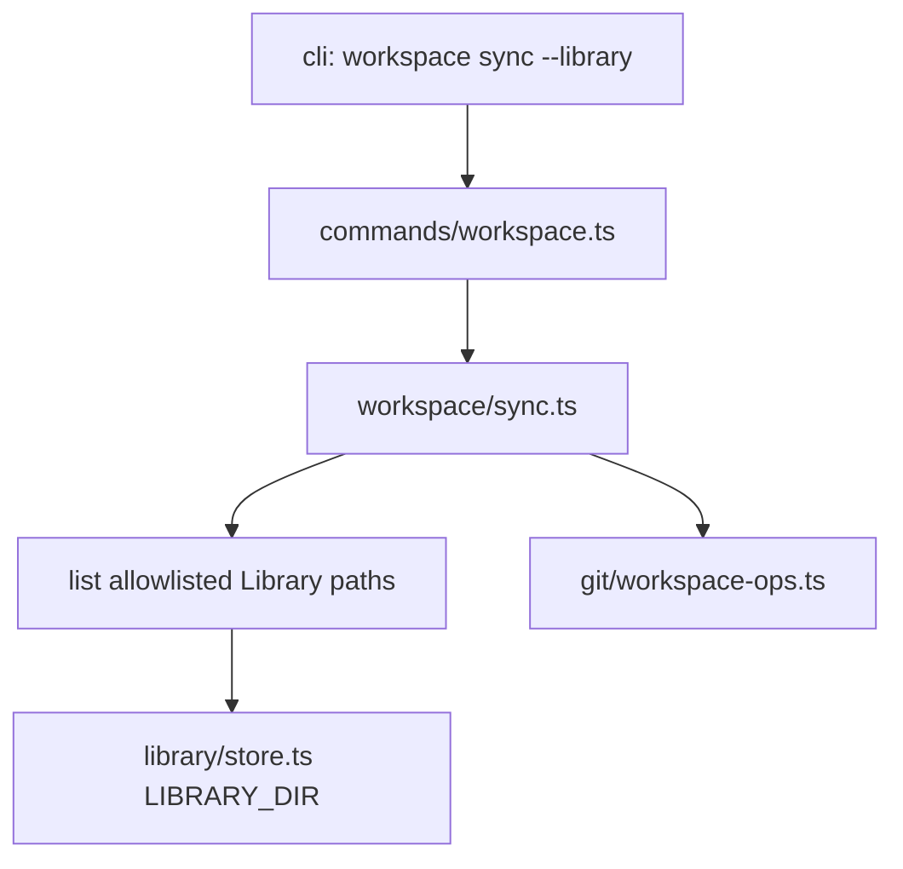

# 【workspace】Library 深读与评论进入超级仓 git

- Issue: #173
- 状态: Approved
- 最后更新: 2026-09-03

## 1. 背景

[Issue #173](https://github.com/xforce-io/researcher/issues/173)。Workspace [Library](../glossary.md) 的机器深读与人工 Notes 落在超级仓 `.researcher-workspace/library/`（#57 / #61 / #89），但从未进入 git。[Workspace sync](../glossary.md)（#130）只对齐 topic 子仓与 Pointer，不覆盖 Library。clone 超级仓后 `serve` 看不到逐篇 Essence 与评论。

## 2. 名词解释

本设计新增 **Library sync**。其余见 [名词表](../glossary.md)，不抄。

| 规范名 | 本设计中的含义 |
|---|---|
| Library sync | `workspace sync --library`：把允许的 Library 文件提交进超级仓。 |

## 3. 目标与非目标

- **目标**：
  - CLI 增补 `researcher workspace sync --library`
  - 超级仓 commit 允许的 Library 账本与 `reads/*.md`
  - 与 `delivery.mode`、topic 仓、`--pull` / `--push-topics` / `--pointers` 正交；可 `--dry-run`
  - 摘要可判定；失败时 exit 1；无关 staged 拒绝且不破坏既有 index
- **非目标**：
  - 不把 Library 写入 topic 仓
  - 不开 Library PR、不 `git push` 超级仓
  - 不自动按 note 提交
  - 不改 `run` / package / serve IA
  - 不重命名 `.researcher-workspace`
  - 不改 Library 数据模型

## 4. 能力

N/A：无新用户功能面，仅既有 CLI 增补一个动作。

### 4.1 UI/UX

N/A：无 Web 页面。stdout 增加一行 `library: …`。

## 5. 思路与折衷

候选：

1. **超级仓 commit 允许路径（采纳）** — Library 本就是工作区对象；双轨保留；clone + `serve` 可恢复。
2. **integrate 时抄进 topic notes** — 打穿双轨，多 topic 重复，未 link 论文仍丢。
3. **独立 library submodule** — 多一个 remote，过重。

放弃 2/3。`--library` 学 `--pointers`：只 commit、不 push、不开 PR。无动作 flag 仍默认 `--pull`，避免裸 `sync` 误提交 Library。允许路径用白名单 `git add`，不依赖 `git add -A`，因此缺 gitignore 也不会把 PDF 扫进去。

## 6. 架构



**主路径**：校验 workspace 根 → `--library` 启用 → 超级仓是 git → index 无无关 staged → 只 `git add` 白名单路径 → 有 staged 则 commit `workspace sync: commit library state` → 摘要 `library=committed count=N`。

**失败路径**：非 workspace → exit 2；超级仓非 git / 无关 staged / git 失败 → `library=failed`，exit 1，不改 HEAD，不碰既有 staged。无 Library 目录或无允许文件变更 → `library=no-op`，exit 0。

与 `--pointers` 同命令时串行、各打各的 commit（先 pointers 后 library）。

## 7. 模块

| 模块 | 职责 |
|---|---|
| `src/cli.ts` / `commands/workspace.ts` | `--library` flag 传入 |
| `src/workspace/sync.ts` | 编排、白名单列举、摘要 |
| `src/git/workspace-ops.ts` | 复用 `assertNoStagedChanges` / `commitIfStaged`；新增按路径 stage |
| `src/library/store.ts` | 复用 `LIBRARY_DIR`，不改账本格式 |

## 8. API / CLI

```text
researcher workspace sync [options]
  --library           将允许的 Library 文件 commit 进超级仓（不开 PR、不 push）
```

无任何动作 flag 时仍默认 `--pull`，`library=false`。仅 `--library` 时不隐式 pull。

允许路径（相对超级仓根）：

```text
.researcher-workspace/library/papers.jsonl
.researcher-workspace/library/reads.jsonl
.researcher-workspace/library/links.jsonl
.researcher-workspace/library/integrations.jsonl
.researcher-workspace/library/notes.jsonl
.researcher-workspace/library/papers/<paperId>/reads/*.md
```

排除：`*.pdf` / `*.PDF`、`**/_extracted/**`、其它未列出路径。

摘要：

```text
library: committed count=3
library: no-op
library: dry-run count=3
library: failed (super-repo has staged changes: unrelated.txt)
```

Exit：与 #130 相同 — 存在 failed → 1；用法/非 workspace → 2。

## 9. 边界

- 只写超级仓；零 topic 文件变更；不调用 `gh`
- 脏 index：有 staged 则失败；不 stash
- 无 Library 目录：no-op，不是 failed
- 凭证：沿用 #130 脱敏
- 并发：不做，串行

## 10. 迁移 / 兼容 / 回滚

无数据迁移。既有 untracked Library 在首次 `--library` 后进入超级仓。缺省行为不变。回滚即去掉 `--library` 实现；已提交的 git 历史由用户保留。

## 11. 测试计划

- **E2E / Integration**（`tests/workspace/sync.test.ts`，对 S1/S2/S3）：
  1. fixture：超级仓 + 1 篇 `reads/*.md` + `notes.jsonl` + 故意放的 PDF 与 `_extracted`
  2. `--library` → committed；`git ls-files` 含 md 与 jsonl，0 条 pdf/_extracted
  3. 无变更再跑 → no-op
  4. 无动作 flag → `actions.library=false`，HEAD 不变
  5. `--library --dry-run` → dry-run，HEAD 不变
  6. 无关 staged → failed，exit 聚合为 failed≥1，staged 原样
- **Unit**：`resolveActions` — 无 flag 不含 library；仅 `--library` 时 pull=false、library=true

## 12. 开放问题

无。超级仓是否随后 `git push` 仍由人执行，与 `--pointers` 一致。

## 13. 关联

- Issue #173
- L1：issue comment「设计（L1 概要）」
- #130、#57、#61、#89
- 模块：`src/workspace/sync.ts`、`src/git/workspace-ops.ts`、`src/cli.ts`
