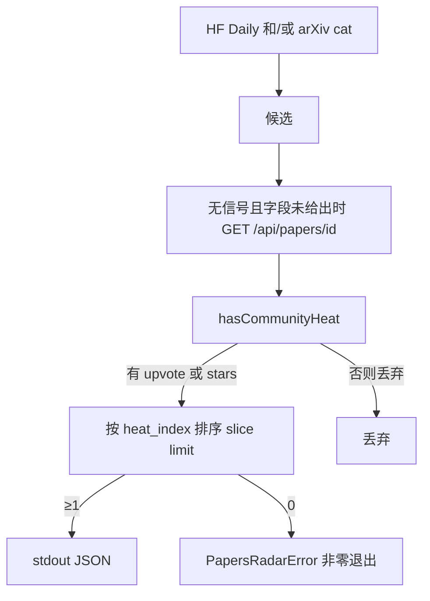

# #180 热榜只保留有社区热度的论文

- Issue：[#180](https://github.com/xforce-io/researcher/issues/180)
- L1：会话批准（2026-09-06）：社区热度门禁，不改 heat 公式，不加引用 API。
- 分支：`feat/180-trending-community-heat`
- 状态：Approved
- 日期：2026-09-06

本文件是详细设计唯一事实源。Issue 仅保留不超过 10 行的设计摘要与链接。

## 1. 背景

[#180](https://github.com/xforce-io/researcher/issues/180)。[#170](./170-papers-cli.md) §8.3 给无 upvote、无 star 的新 arXiv 文约 30 分。HF Daily 失败时回退分类最新投稿，热榜变成「最新」而非「社区热」。

## 2. 名词解释

- **热榜**：见[名词表](../glossary.md)。
- **社区热度**：HF Daily / paper API 的 upvote > 0，或 GitHub stars > 0。无则不算热榜条目。

已有 papers CLI、heat_index 只链不抄。

## 3. 目标与非目标

### 3.1 目标

- S1：`trending` 成功列表不含无社区热度条目；有信号的按 `heat_index` 降序；篇数 ≤ `--limit`，允许更短。
- S2：arXiv 来源先用既有 `GET /api/papers/{id}` 回填 upvote/stars，再出门禁；全无信号则失败可判定。

### 3.2 非目标

不改 `calculateHeatIndex`。不接引用 API。不改 JSON 必填字段。不改 `search` / `show` 列出规则。不灌 discover。

## 4. 能力

### 4.1 UI/UX

N/A。无新页面。Home 热榜仍同源 `fetchTrendingPapers`；过滤后 0 篇沿用 #172 不渲染铬。

## 5. 思路与折衷

门禁放在 `fetchTrendingPapers` 出口，不改公式：`search`/`show` 与单测中的「arxiv 无信号 = 30」保持。arXiv 回退若直接丢弃会变成死路径，故回填既有 HF paper API，有信号才留。放弃用新鲜度当分；放弃 Semantic Scholar/OpenAlex。

## 6. 架构

主路径：日榜有 upvote/stars 的直接过门。  
失败路径：源失败仍按 #170 回退；回填后 0 篇抛错，不拿最新投稿充数。单篇回填 404/超时应丢该篇，不整次失败。

## 7. 模块

- `src/sources/paper-heat.ts`：新增 `hasCommunityHeat`。
- `src/sources/papers-radar.ts`：回填 + 门禁 + 排序截断。
- 测试：`paper-heat.test.ts`、`papers-radar.test.ts`。
- Home / CLI 调用点不改。

## 8. API/CLI

无新 flag、无新 JSON 必填字段。

| 入口 | 变更后 |
|---|---|
| `researcher papers trending` | 成功列表每篇满足社区热度；可短于 `--limit`；0 篇 exit 1 |
| GET Home 热榜 | 同源；0 篇不渲染 |

`source` 仍表示发现来源（arxiv 回退保持 `arxiv`），回填只补信号。

## 9. 边界

`--source arxiv` 同样过门禁。显式 `upvotes: 0` 且无 stars 不再打 paper API。不并行打引用源。

## 10. 迁移/兼容/回滚

无存数迁移。回滚即去掉门禁与回填。缓存的当日热榜文件不迁移，下一日重拉。

## 11. 测试计划

| 层级 / 验收 | 路径与可判定结果 |
|---|---|
| E2E/S1 | stub HF Daily：0 upvote 无 star 的条目不在结果中；有信号按 heat 降序；长度 ≤ limit |
| E2E/S2 | Daily 502 + arXiv 条目 + paper API 有 upvote → 保留；paper API 404 → 整表失败 |
| Unit | `hasCommunityHeat`：缺省/0 为假，upvote 或 stars >0 为真；`calculateHeatIndex` 原断言不变 |

## 12. 开放问题

无。

## 13. 关联

- 验收：[#180](https://github.com/xforce-io/researcher/issues/180)
- 前序：[170-papers-cli.md](./170-papers-cli.md)、[172-home-trending.md](./172-home-trending.md)
