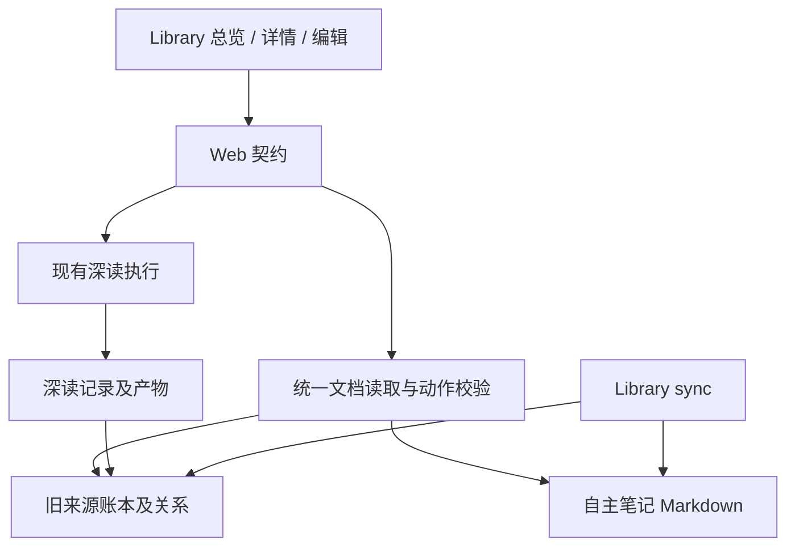

# Library 统一文档模型与自主笔记

- Issue：[#186](https://github.com/xforce-io/researcher/issues/186)
- L1：[概念方向与范围](https://github.com/xforce-io/researcher/issues/186#issuecomment-5611035884)，用户已确认平级模型并要求继续 L2。
- 状态：**Draft · 待人工评审**
- 日期：2026-09-10
- 分支：`feat/186-standalone-notes`

## 1. 背景

Library 当前以 `Paper` 作为共同对象，但 `docType` 已支持 paper、blog、design-doc、spec、api-doc、other。`Paper` 要求来源身份，论文批注要求 `paperId`，因此自主写作无法直接成为 Library 条目。另建笔记区域会重复列表、导航和管理关系。

本设计将共同概念提升为文档，在同一 Library 管理平级类型，并保留原文档、深读记录、深读产物之间的归属。Issue 是验收依据，本文件是详细设计的唯一事实源；旧设计仅在未被本文件明确变更的范围内适用。

## 2. 名词解释

规范定义见[名词表](../glossary.md)，本次新增文档、自主笔记、深读记录、深读产物，并修订 Library。

易混边界：类型为 `note` 的自主笔记有独立文档身份；现有论文详情 Notes 对应论文批注，仍依附原文档。深读产物是派生内容，不等于自主笔记；机器协助写作也不使一篇自主笔记变成深读产物。`paperId` 在旧账本与接口中继续作为兼容字段名，不代表新的上层分类。

## 3. 目标与非目标

目标：同一个 Library 创建、浏览和按类型筛选文档；自主笔记无需来源或 topic 即可保存和持续编辑；既有导入、去重、深读、论文批注及 topic 关系保持可用；新内容可随 Library sync 进入 Git 并在 clone 后恢复。

非目标：来源文档父类型、paper 作为 note 子类型、独立笔记导航区、全量旧账本改名、通用能力插件框架、新来源适配器、富文本编辑、全文搜索、AI 代写、发布协作、结构化引用、note 的 topic 关联/综合/深读、产物转 note，以及 note 删除/归档/历史恢复。编辑器本期不支持本地附件上传。

## 4. 能力

### 文档及附属内容契约

文档共同字段：稳定 `id`、`docType`、可选标题、标签集合、创建时间、更新时间。`docType` 为 paper / blog / design-doc / spec / api-doc / other / note；来源、内容维护方式与类型分别表达，不建立父类型。共同领域表示不能要求所有文档具备 `canonicalSource`。

| 内容 | 身份与信息 | 生命周期 |
|---|---|---|
| 已有外部材料 | 保留原 ID、来源集合、标识、标签及类型；缺类型时按 paper | 继续通过原来源导入与去重更新 |
| 自主笔记 | `doc_<UUID>`，类型 note，可选标题及 Markdown 正文；本期标签为空，不提供标签编辑 | 用户显式保存；不要求来源；不可被深读覆盖 |
| 深读记录 | 独立执行 ID、原文档 ID、状态、时间、产物路径及失败原因 | queued / reading / read / failed，沿用已有执行行为 |
| 深读产物 | 归属具体深读记录及原文档 | 附属展示，不进入 Library 文档数量与筛选结果 |
| 论文批注 | 保留现有 ID、`paperId`、种类、正文与钉选状态 | 现有创建、钉选、删除行为不变 |

既有深读记录仍以 `paperId` 落盘，领域读取时解释为文档关联；不将旧 `reads`、`notes`、`links`、`integrations` 账本全量改写。既有 paper ID 中含 `paper_` 也不重生成。topic 关联与综合历史继续分开读取，关联不代表已综合。

### 支持动作

| 动作 | 已有外部材料 | 自主笔记 |
|---|---|---|
| Library 浏览、元数据搜索、类型筛选、详情 | 支持 | 支持 |
| 原来源打开、导入去重 | 沿用已有来源 | 不提供 |
| 深读、查看产物与状态 | 沿用已有能力 | 不提供，不显示 unread |
| 编辑原正文 | 不提供 | 支持 |
| 论文批注、topic 关联与综合 | 保留既有范围 | 本期不提供 |
| 删除 | 保留既有关联阻止规则 | 本期不提供 |

动作规则由领域边界统一判断，前端隐藏不支持的按钮不能替代服务端校验。不持久化一套可配置能力列表；本期类型与已存在来源/内容的约束即可表达规则。导入接口只接受已有六种外部形式，不允许通过 `docType=note` 绕过自主笔记创建。

### 4.1 UI/UX

**信息架构**：保留 Workspace / Library / Topics；不新增 Notes 导航。Library 总览与所有文档详情均激活 Library 导航。统一详情地址为 `/library/d/:id`，旧论文地址兼容跳转；创建笔记地址为 `/library/new?type=note`。

**总览布局**：沿用当前列表结构，顶部标题 Library，右侧一个 `＋ Add` 菜单，内含 `Add source` 与 `Write note`。列表列为标题、类型、来源、标签、状态、更新时间；移动端压缩成同一条目的纵向信息，不另建页面。类型使用可辨识文本徽标；note 来源位置显示 `—`，状态显示 `Saved`，不伪造来源或深读状态。无标题 note 显示 `Untitled note`，不将该占位写进标题字段。

默认展示 All，以文档 `updatedAt` 降序、ID 升序稳定排序；不是默认 Unlinked。计数只计算独立文档。类型筛选为 All 及七个具体类型；与现有状态、元数据搜索取交集。元数据搜索覆盖标题、标签、来源标识，不搜索正文或深读产物。类型与搜索、状态写入 URL，刷新保持；返回 Library 保留进入详情时的筛选，直接打开详情则返回默认 All。

既有 Unread / Read 筛选只匹配支持深读的文档；Linked / Integrated 只匹配实际关系；Unlinked 包含没有关联的 note，不代表等待综合。类型为 note 且状态选择 Read 时显示无结果，不隐式更改筛选。未知类型或状态查询返回可解释的 400 页面并提供清除筛选入口。

**来源创建**：菜单打开现有导入弹窗，文案改为 Add source；沿用输入、tags、topic context 与校验。提交中禁用重复提交；失败在弹窗内保留输入并解释原因；成功回 Library 或按现有 next 参数进入详情。关闭、Escape 和遮罩不改变已入库内容。

**共同详情框架**：返回 Library、一个标题、类型及更新时间、中央内容区、支持动作区。外部材料保留来源元数据、Essence/深读正文、进度和原有动作；原 Notes 区标题改为 `Annotations`，锚点 `#notes` 不变。自主笔记中央呈现 Markdown，动作仅 Edit；不展示空的深读、来源、topic 或批注面板。

**编辑**：新建直接进入编辑态，焦点在正文；顶部可选标题，中央多行 Markdown 输入，下方 Save / Cancel。编辑已有 note 时载入原文和版本；保存成功进入阅读态，明确显示 Saved。无需双栏、实时预览或自动保存；阅读态使用现有安全 Markdown/公式渲染。标题最多 200 个 Unicode 码点，正文 UTF-8 最多 1 MiB，正文 trim 后必须非空，但保存不删改原始正文空白与换行。

| 状态 | 用户可见行为与恢复 |
|---|---|
| 空 Library | 显示尚无文档，提供同一创建菜单 |
| 筛选无结果 | 显示无匹配文档，提供清除筛选；不误报 Library 为空 |
| 初始编辑 | 可输入并保存；新建尚无持久化条目 |
| 已修改 | 显示 Unsaved changes；Cancel 或应用内离开需确认放弃，本页保留内容直到确认 |
| 保存中 | 显示 Saving，禁用 Save、编辑和重复提交，保留本次输入 |
| 校验错误 | 指明标题/正文错误，回到编辑态、保留输入并定位错误字段 |
| 网络/保存失败 | 显示 Not saved 或无法确认结果，保留输入及同一提交标识，可原样重试 |
| 版本冲突 | 显示远端已更新，保留输入，提供打开最新版本的新标签页与复制当前正文；不自动覆盖或合并 |
| 保存成功 | Saved；使用服务器返回版本，阅读态与列表可重载同一内容 |
| 详情不存在 | 404，返回 Library；不自动创建空记录 |
| 内容损坏 | 显示该文档无法读取及文件位置；其余条目可浏览，不把损坏文档显示成空白可保存文档 |
| 来源未读/执行中/成功/失败 | 保留当前深读状态；执行失败保留文档及最后可用成功产物，显示新失败原因，可重试 |

浏览器刷新/关闭使用原生未保存提示；不承诺进程崩溃后恢复未保存输入。保存失败的保留保证针对仍在当前页面的输入。键盘可打开菜单、Tab 移动、Escape 关闭并回到触发按钮；保存结果使用可被辅助技术读取的状态提示。现有英文 UI 延续英文，本设计说明使用中文。

**Workspace Home**：Library 文档总数与最近内容纳入 note，文案使用 Documents；深读待办、失败数和 topic 待处理仅统计支持相应能力的内容，note 不制造待处理提醒。热榜仍只展示论文。Home 中通用创建动作与 Library 使用相同菜单，明确的热榜导入动作维持原意。

## 5. 思路与折衷

选择“平级文档概念 + 统一读取边界 + 增量存储”。领域与页面统一，既有来源数据继续保存在旧账本，自主笔记以单文件保存。物理格式差异是兼容策略，不是“来源文档”父类型，也不产生第二个产品列表。

放弃全量迁移到 documents.jsonl：现有 CLI、pipeline、关联及产物路径均依赖旧身份和存储，全量切换会扩大回滚与旧版本互操作风险。代价是存储边界需要把两种格式映射到统一文档，内部旧名称短期保留。

放弃 metadata 账本加独立正文双份存储：一篇 note 的标题、版本和正文应在一次原子替换中生效，避免成功提示后只有半篇内容。代价是列表需要读取 Markdown 元数据，本期不做独立索引或缓存数据库。

放弃将每次深读结果独立入库：产物与执行状态共同管理，重跑不会制造副本。未来若支持“基于产物写笔记”，必须显式生成新文档并保留派生关系，不在本期预置入口或空字段。

## 6. 架构

分层：Web 负责路由、表单与反馈；文档边界负责统一身份、类型、读取和动作约束；持久化边界保证 note 的版本检查及原子保存；现有深读和 topic 编排继续消费可用外部材料，不消费所有文档。

主路径：Library 统一读取 → 选择写笔记 → 获取新 ID → 提交正文及版本 → 校验并原子保存 → 返回确定的 ID/版本 → 阅读态及列表重载。导入沿用旧写路径，其结果立即经统一文档读取可见。深读产生附属记录和产物，文档总数不变。

失败路径：输入错误在持久化前终止；并发版本冲突拒绝覆盖；写入失败保留旧文件；响应丢失通过同一提交标识重试确认。列表读取某个新文档失败时隔离该条目并显示错误，不将损坏内容丢弃或覆盖。

不新增进程、数据库、LLM 调用或运行时依赖。当前 localhost 运行边界不变。

## 7. 模块

| 边界 | 责任 |
|---|---|
| Library 文档领域与存储 | 类型、统一读取、动作校验、note 原子保存、旧数据映射 |
| Web 数据读取 | 总览/详情/Home 的文档投影、筛选与计数；深读统计仍限定支持范围 |
| Web 路由与展示 | 统一详情、创建菜单、编辑与错误状态、旧链接兼容 |
| 现有来源 CLI / 深读 / topic 编排 | 保留来源身份、输出与执行语义，禁止把 note 当作外部来源消费 |
| Workspace sync | 将新增文档路径加入显式白名单，保留原 staged/提交/不 push 规则 |

模块表描述职责，不要求按表新增目录或类。具体拆分与函数命名归实现计划和 PR。

## 8. API/CLI

### Web 读取

| 方法与路径 | 契约 |
|---|---|
| GET `/library` | 统一文档列表；可选 `type`、`status`、`q`；type 缺省/all 表示全部 |
| GET `/library/d/:id` | 统一详情，未知 ID 为 404 |
| GET `/library/new?type=note` | 返回新建编辑页及随机文档 ID，不落盘；其他 type 返回 400 |
| GET `/library/d/:id/edit` | 仅 note 可编辑；不存在 404，不支持 422 |
| GET `/library/p/:id` | 302 到对应统一详情；保留 `#notes` 兼容行为，不修改原文档 ID |
| GET `/library?paper=:id` | 兼容 selected 参数，直接跳转统一详情 |

`type` 允许七种具体类型及 all；`status` 允许 all/unlinked/unread/read/linked/integrated。旧默认链接无参数仍有效，默认展示 All 是本次有意改变的产品行为。

### 自主笔记保存

POST `/library/documents/save`，JSON 请求与 JSON 响应；仅用于 note，不复用现有 `/library/note` 论文批注接口。

请求包含：`id`（`doc_<UUID>`）、`title`（字符串，可空）、`body`（Markdown）、`expectedRevision`（新建 0，编辑为已加载整数版本）、`mutationId`（该次逻辑提交 UUID）。不接受客户端来源、路径、类型切换或时间字段。一次保存最多 2 MiB 请求体，超限 413；正文及标题限制见 §4.1。

| 结果 | HTTP / 可判定行为 |
|---|---|
| 创建成功 | 201，返回 id、revision=1、updatedAt、规范详情 URL |
| 更新成功 | 200，同一 id，revision 加一 |
| 同次提交原样重试 | 200，返回已保存版本，不再次增加版本或更新时间 |
| 无效字段/版本格式/空正文 | 400，字段错误，无写入 |
| 文档不存在但 expectedRevision > 0 | 404，不转为创建 |
| 保存到非 note | 422，无写入 |
| 版本冲突或同 mutationId 不同内容 | 409，返回错误码与当前版本，不覆盖 |
| 请求过大 | 413，无写入 |
| 无法取得写锁 | 503，可重试，不宣称成功 |
| 持久化错误 | 500，不宣称成功；旧版本完整 |

成功仅在持久化替换完成后返回。页面对网络异常保留同一 mutationId；确认成功或用户变更输入后才开始新的逻辑提交。重试若已发生后续更新，则返回 409，不把旧响应伪装成最新内容。

既有 `/library/add`、`read`、`note`、`link`、`unlink`、`delete` 和 stream 保留字段及旧调用方式。统一详情中的旧表单仍提交原 paper ID；对 note ID 显式拒绝不支持动作，不创建孤立深读/批注/关系记录。来源导入与 note 保存的输出不可互相冒充。

### CLI

现有 `papers`、`library add/list/link/...`、`add`、`read` 等命令输出及来源支持范围不变；兼容 CLI 的 `library list` 本期仍仅列既有外部材料，明确记录在帮助/README 中，不伪造 note 的 canonical source 列。统一文档列表与 note 编辑本期由 Web 提供，不新增 note CLI。

`researcher workspace sync --library` 纳入 §10 新路径；无 flag 的默认行为、dry-run、exit 语义及不 push 保持 #173。

## 9. 边界

- 同一来源导入保留原确定性 ID 和去重语义。自主笔记相同正文不去重，两次独立创建代表不同意图；同次保存重试必须去重。
- note 本期不能通过客户端修改 docType 变为 paper，也不接受导入流程生成 note；这是当前支持动作范围，不是继承层级。
- note 修改采用版本检查，不以时间戳判断新旧；两个编辑页面中后保存的旧版本必须冲突，不提供强制覆盖入口。
- 新 ID 只允许规范 UUID，路径由服务端构造；拒绝路径穿越、符号链接及越界文件，沿用现有安全路径边界。
- 新 Markdown 内容不执行 HTML；标题和编辑文本按文本转义，阅读态沿用安全渲染并验证脚本、事件属性与危险链接无执行。普通正文链接不作为服务端抓取或综合指令。
- 不增加跨域写入能力；新保存端点要求 JSON，对存在 Origin 的请求只接受当前服务同源，拒绝其它来源。仍仅绑定 localhost，不新增鉴权产品。
- 一个 workspace 中新 note 写入需跨进程串行化其版本检查与替换；不能只依赖浏览器禁用按钮。原来源账本的既有多进程限制不在本期扩张改造范围。
- 手动改文件保留为 Git/文本工作流，但必须遵守 frontmatter 契约；不支持绕过版本递增与 Web 同时修改。跨机器 Git 冲突由用户处理，服务不得把冲突标记当有效笔记覆盖。

## 10. 迁移/兼容/回滚

### 存储与版本

旧 `papers.jsonl` 及 reads/notes/links/integrations 账本和产物路径保持原样，无启动时全量改写、双写或删除。统一文档读取将它们映射为对应平级类型；缺 docType 按 paper。新增 note 唯一事实源为：

`.researcher-workspace/library/documents/doc_<UUID>.md`

单文件由 YAML frontmatter 和原始 Markdown 正文组成。frontmatter 固定字段：`schemaVersion: 1`、`id`、`docType: note`、可选 `title`、`tags: []`、`createdAt`、`updatedAt`（UTC ISO 时间）、`revision`（从 1 递增）、`lastMutationId`。文件名与 id 必须一致；未知 schemaVersion 或损坏文件不可编辑，并在 Library 明确提示。此目录本期仅新增 note，但不建立新的概念父类。

没有独立元数据索引，因此不会出现正文与账本半更新。元数据必须使用安全 YAML 序列化，正文中出现 `---` 不得改变头部边界。

### 保存原子性与并发

在 workspace Library 范围的进程间写锁下校验版本及重试标识，将完整新文件写到同目录非白名单临时文件，完成落盘后原子替换，再返回成功；任何替换前失败保留旧文件。临时文件不会被读取成文档或同步。新建 ID 若已存在，不可无条件覆盖；只有当前 lastMutationId 与内容匹配才认作重试。

锁采用本地进程存活可验证的所有者信息，等待上限 5 秒，超时 503；只在确认原持有进程已退出且锁仍属于该持有者时回收，不按“时间久”抢占活锁。实现可选择符合此可观察契约的本地锁方式，不新增服务。若不能满足并发与原子性验证，应在实现评审中阻止交付。

### Library sync

在 #173 白名单基础上，仅新增 `documents/doc_<UUID>.md` 常规文件及这些已跟踪路径的删除；不包含任意目录递归、临时文件、锁、PDF、提取缓存或符号链接。dry-run 不写数据/不创建锁文件；正常 sync 对新 note 的枚举、stage、commit 与 Web 保存协调同一写锁，保证成功提交的 note 是完整保存版本。锁超时输出 library failed、exit 1；保存返回可重试状态。

保存不自动 commit/push；显式 `workspace sync --library` commit 后，clone 可恢复 note、旧来源及附属内容。新文档保存晚于本次同步快照时保留为下次待同步变更。现有非空 index 拒绝行为、失败时 HEAD/index 保护及不 push 语义不变。

### 兼容与回滚

- 新版读取纯旧 workspace 不新增数据文件；第一次成功创建 note 才新增文件。旧 paper ID、CLI 输出、产物路径及 topic 关系保持。
- 旧链接跳转到新详情，原 `#notes` 仍定位论文批注；旧 POST 和 stream 不强制客户端迁移。
- 回滚程序版本后，旧材料、批注和关系仍可用；旧版忽略新增 documents 目录，note 在旧 UI 不可见但文件必须保留，不能宣称数据丢失或自动清理。
- 旧版 Library sync 不负责提交 note，回滚前停止写入并用新版显式同步或备份新增目录；升级回来后直接重载。回滚不执行破坏性 schema 降级，也不要求还原旧账本快照。
- 本次发布若无法保证旧账本原样兼容，则需重开设计评审，不能以实现便利替换成未评审全量迁移。

## 11. 测试计划

本节是实现后的验证契约，不表示当前设计文档已通过功能测试。层级仅 E2E / Integration / Unit。

### E2E

启动真实 HTTP 服务和临时 workspace，以浏览器执行页面到磁盘闭环；深读外部运行时使用可控替身，不用替身替代保存与页面逻辑。

| 验收 | 路径 | 可判定结果 |
|---|---|---|
| S1 | 空 Library → Write note → 无标题写正文 → Save → 列表再打开 | 新增 1 份 note，无来源/topic 要求，正文一致 |
| S2 | 已有 note → Edit → Save → 刷新 → 重启服务再打开 | 同一 ID、仅 1 份、最新正文；版本递增一次 |
| S3 | 空白提交；注入磁盘失败；模拟服务已保存但响应丢失后原样重试 | 正确错误状态、页面输入保留、旧文件完整；恢复后 1 份记录、无重复版本 |
| S4 | 既有 paper/批注/产物/topic 关系及 note → 添加来源 → 原 paper force 深读 | 原来源流程成功，重跑新增 0 文档，归属与关系保留，人类内容原文不变，无自动综合 |
| S5 | paper/blog/note 各 1 份 → All → 各类型筛选 → 打开详情 | All=3，各类型=1，动作矩阵正确，产物不列为条目 |

另覆盖：Home 文档计数含 note 而深读待办不含；菜单键盘操作；筛选 URL 刷新恢复；Cancel/离开确认；未保存刷新提示；保存中重复点击；两标签页编辑冲突不覆盖；移动布局无横向遮挡；旧 URL、锚点与表单兼容。外部材料创建失败保留表单。

### Integration

- 旧 workspace 只读加载前后文件字节不变，ID/来源去重/类型缺省/关联历史不变；新旧 CLI 来源输出兼容，note 不进入来源流水线。
- 新文件完整读写、重启重载、特殊 YAML 标题和 Markdown 分隔符；标题/正文边界及超限 413；损坏/未知版本文件隔离且不能被覆盖。
- 两个服务进程竞争同一版本只成功一个；原样重试不重复写，旧 mutationId 在后续更新后冲突；进程死亡锁可恢复，活锁不抢占，超时可判定。
- 失败写入与进程中断不产生半文件；任何临时文件不被枚举为文档。
- `workspace sync --library` 后 git ls-files 包含 note 及旧白名单，排除临时文件/锁/PDF/提取缓存；clone 后统一 Library 恢复。
- sync dry-run、重复 no-op、非空 index 拒绝、错误后原 index/HEAD 保留、新 note 写入与同步串行；旧版回滚读取仍可工作、新 note 文件原样保留。
- 新保存端点对非 note、越界 ID、符号链接、跨源请求拒绝；Markdown 危险输入不执行，编辑 textarea 不能被正文闭合注入。

### Unit

类型与动作矩阵、缺省类型、筛选交集及稳定排序、文档/产物计数分离、版本与重试判定、保存校验和安全文件名边界。

实现交付时执行 `npm run build`、`npm run lint`、`npm test`，并记录上述浏览器 E2E 的具体命令/步骤和结果；现有测试分布在 `tests/library`、`tests/web`、`tests/workspace`，必要的新测试文件归实现计划。不以 DOM 快照或同构实现测试代替 S1–S5。

## 12. 开放问题

无待选方案阻塞设计成稿。需人工批准本文件的完整契约，尤其是：增量存储兼容策略、CLI 本期来源范围不变、note 纳入显式 Library sync，以及本期不开放 note 的 topic 关联与深读。这些均为本稿明确选择，不留给实现阶段自行决定。

## 13. 关联

- [Issue #186](https://github.com/xforce-io/researcher/issues/186) · [L1](https://github.com/xforce-io/researcher/issues/186#issuecomment-5611035884)
- [名词表](../glossary.md)
- [#89 论文批注](89-paper-local-notes.md)、[#65 Library 信息架构](65-rework-workspace-root-library-ia.md)、[#173 Library sync](173-library-workspace-sync.md)
- 当前依据：`src/library/model.ts`、`src/library/store.ts`、`src/library/doc-type.ts`、`src/library/identity.ts`、`src/commands/library.ts`、`src/web/server.ts`、`src/web/discovery.ts`、`src/web/views.ts`、`src/workspace/sync.ts`。
- [设计 PR #187](https://github.com/xforce-io/researcher/pull/187)；实现 PR：尚未开始。
