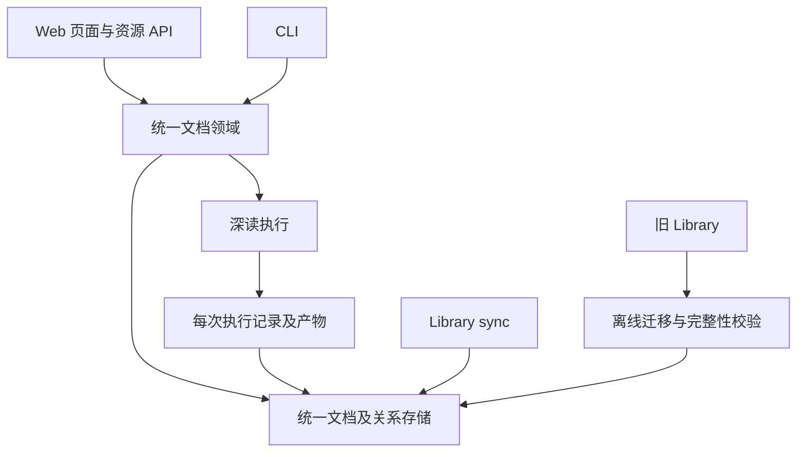

# Library 统一文档模型与自主笔记

- Issue：[#186](https://github.com/xforce-io/researcher/issues/186)
- L1：[概念方向与范围](https://github.com/xforce-io/researcher/issues/186#issuecomment-5611035884)，用户已确认平级模型，并进一步选择一次完整迁移、不保留旧接口兼容。
- 状态：**Draft · 待人工评审**
- 日期：2026-09-10
- 分支：`feat/186-standalone-notes`

## 1. 背景

Library 当前以 `Paper` 作为共同对象，但 `docType` 已支持 paper、blog、design-doc、spec、api-doc、other。`Paper` 要求来源身份，文档批注要求 `paperId`，因此自主写作无法直接成为 Library 条目。另建笔记区域会重复列表、导航和管理关系。

本设计将共同概念提升为文档，在同一 Library 管理平级类型，并保留原文档、深读记录、深读产物之间的归属。Issue 是验收依据，本文件是详细设计的唯一事实源；旧设计仅在未被本文件明确变更的范围内适用。

## 2. 名词解释

规范定义见[名词表](../glossary.md)，本次新增文档、自主笔记、深读记录、深读产物，并修订 Library。

易混边界：类型为 `note` 的自主笔记有独立文档身份；现有论文详情 Notes 对应文档批注，仍依附原文档。深读产物是派生内容，不等于自主笔记；机器协助写作也不使一篇自主笔记变成深读产物。新模型统一使用 `documentId`；旧 `paperId` 仅由一次性迁移读取，不进入新版运行契约。

## 3. 目标与非目标

目标：同一个 Library 创建、浏览和按类型筛选文档；自主笔记无需来源或 topic 即可保存和持续编辑；既有导入、去重、深读、文档批注及 topic 关系保持可用；新内容可随 Library sync 进入 Git 并在 clone 后恢复。

非目标：来源文档父类型、paper 作为 note 子类型、独立笔记导航区、运行时旧格式适配、旧 URL 重定向、旧 API/CLI 输出兼容、通用能力插件框架、新来源适配器、富文本编辑、全文搜索、AI 代写、发布协作、结构化引用、note 的 topic 关联/综合/深读、产物转 note，以及 note 删除/归档/历史恢复。编辑器本期不支持本地附件上传。

## 4. 能力

### 文档及附属内容契约

文档共同字段：稳定 `id`、`docType`、可选标题、标签集合、创建时间、更新时间。`docType` 为 paper / blog / design-doc / spec / api-doc / other / note；来源、内容维护方式与类型分别表达，不建立父类型。共同领域表示不能要求所有文档具备 `canonicalSource`。

| 内容 | 身份与信息 | 生命周期 |
|---|---|---|
| 已有外部材料 | 迁移保留对象身份、来源集合、标识、标签及类型；旧数据缺类型时按 paper | 继续通过原来源导入与去重更新 |
| 自主笔记 | `doc_<UUID>`，类型 note，可选标题及 Markdown 正文；本期标签为空，不提供标签编辑 | 用户显式保存；不要求来源；不可被深读覆盖 |
| 深读记录 | 每次执行独立 read ID、documentId、状态、时间、产物路径及失败原因 | queued / reading / read / failed；重跑新增执行，不覆盖上次产物 |
| 深读产物 | 归属具体深读记录及原文档 | 附属展示，不进入 Library 文档数量与筛选结果 |
| 文档批注 | 保留批注 ID、迁移为 `documentId`、种类、正文与钉选状态 | 现有创建、钉选、删除行为不变 |

所有关联字段统一为 `documentId`，文档类型不能通过 ID 前缀或存储位置推断。旧 ID 作为不透明身份原值保留，避免无意义地重建身份；新建文档统一使用 `doc_<UUID>`。这是保留数据身份，不是保留旧格式或接口。导入通过规范来源查询既有文档去重，不再从来源计算 paper ID。

每次深读分配 `read_<UUID>`；执行状态取最新记录，正文取最后成功且产物存在的记录。后一次失败不改变前一次产物，页面可同时显示最新失败与上次成功内容。旧版已经覆盖掉的历史不可恢复，迁移只保留实际存在的记录与文件，不编造执行历史。topic 关联与综合历史分别保存，关联不等于已综合。

### 支持动作

| 动作 | 已有外部材料 | 自主笔记 |
|---|---|---|
| Library 浏览、元数据搜索、类型筛选、详情 | 支持 | 支持 |
| 原来源打开、导入去重 | 沿用已有来源 | 不提供 |
| 深读、查看产物与状态 | 沿用已有能力 | 不提供，不显示 unread |
| 编辑原正文 | 不提供 | 支持 |
| 文档批注、topic 关联与综合 | 保留既有范围 | 本期不提供 |
| 删除 | 保留既有关联阻止规则 | 本期不提供 |

动作规则由领域边界统一判断，前端隐藏不支持的按钮不能替代服务端校验。不持久化一套可配置能力列表；本期类型与已存在来源/内容的约束即可表达规则。导入接口只接受已有六种外部形式，不允许通过 `docType=note` 绕过自主笔记创建。

### 4.1 UI/UX

**信息架构**：保留 Workspace / Library / Topics；不新增 Notes 导航。Library 总览与所有文档详情均激活 Library 导航。统一详情地址为 `/library/documents/:documentId`；创建地址为 `/library/documents/new?type=note`。旧路径下线，所有应用内链接与客户端同步切换。

**总览布局**：沿用当前列表结构，顶部标题 Library，右侧一个 `＋ Add` 菜单，内含 `Add source` 与 `Write note`。列表列为标题、类型、来源、标签、状态、更新时间；移动端压缩成同一条目的纵向信息，不另建页面。类型使用可辨识文本徽标；note 来源位置显示 `—`，状态显示 `Saved`，不伪造来源或深读状态。无标题 note 显示 `Untitled note`，不将该占位写进标题字段。

默认展示 All，以文档 `updatedAt` 降序、ID 升序稳定排序；不是默认 Unlinked。计数只计算独立文档。类型筛选为 All 及七个具体类型；与现有状态、元数据搜索取交集。元数据搜索覆盖标题、标签、来源标识，不搜索正文或深读产物。类型与搜索、状态写入 URL，刷新保持；返回 Library 保留进入详情时的筛选，直接打开详情则返回默认 All。

既有 Unread / Read 筛选只匹配支持深读的文档；Linked / Integrated 只匹配实际关系；Unlinked 包含没有关联的 note，不代表等待综合。类型为 note 且状态选择 Read 时显示无结果，不隐式更改筛选。未知类型或状态查询返回可解释的 400 页面并提供清除筛选入口。

**来源创建**：菜单打开现有导入弹窗，文案改为 Add source；沿用输入、tags、topic context 与校验。提交中禁用重复提交；失败在弹窗内保留输入并解释原因；成功进入返回的统一文档详情。关闭、Escape 和遮罩不改变已入库内容。

**共同详情框架**：返回 Library、一个标题、类型及更新时间、中央内容区、支持动作区。外部材料保留来源元数据、Essence/深读正文、进度和原有动作；原 Notes 区标题改为 `Annotations`，锚点统一为 `#annotations`。自主笔记中央呈现 Markdown，动作仅 Edit；不展示空的深读、来源、topic 或批注面板。

**编辑**：新建直接进入编辑态，焦点在正文；顶部可选标题，中央多行 Markdown 输入，下方 Save / Cancel。编辑已有 note 时载入原文和版本；保存成功进入阅读态，明确显示 Saved。无需双栏、实时预览或自动保存；阅读态使用现有安全 Markdown/公式渲染。标题最多 200 个 Unicode 码点，正文 UTF-8 最多 1 MiB，正文 trim 后必须非空，但保存不删改原始正文空白与换行。

| 状态 | 用户可见行为与恢复 |
|---|---|
| 空 Library | 显示尚无文档，提供同一创建菜单 |
| 筛选无结果 | 显示无匹配文档，提供清除筛选；不误报 Library 为空 |
| 初始编辑 | 可输入并保存；新建尚无持久化条目 |
| 已修改 | 显示 Unsaved changes；Cancel 或应用内离开需确认放弃，本页保留内容直到确认 |
| 保存中 | 显示 Saving，禁用 Save、编辑和重复提交，保留本次输入 |
| 校验错误 | 指明标题/正文错误，回到编辑态、保留输入并定位错误字段 |
| 网络/保存失败 | 显示 Not saved 或无法确认结果，保留输入及同一提交标识，可原样重试 |
| 版本冲突 | 显示远端已更新，保留输入，提供打开最新版本的新标签页与复制当前正文；不自动覆盖或合并 |
| 保存成功 | Saved；使用服务器返回版本，阅读态与列表可重载同一内容 |
| 详情不存在 | 404，返回 Library；不自动创建空记录 |
| 内容损坏 | 显示该文档无法读取及文件位置；其余条目可浏览，不把损坏文档显示成空白可保存文档 |
| 来源未读/执行中/成功/失败 | 保留当前深读状态；执行失败保留文档及最后可用成功产物，显示新失败原因，可重试 |

浏览器刷新/关闭使用原生未保存提示；不承诺进程崩溃后恢复未保存输入。保存失败的保留保证针对仍在当前页面的输入。键盘可打开菜单、Tab 移动、Escape 关闭并回到触发按钮；保存结果使用可被辅助技术读取的状态提示。现有英文 UI 延续英文，本设计说明使用中文。

**Workspace Home**：Library 文档总数与最近内容纳入 note，文案使用 Documents；深读待办、失败数和 topic 待处理仅统计支持相应能力的内容，note 不制造待处理提醒。热榜仍只展示论文。Home 中通用创建动作与 Library 使用相同菜单，明确的热榜导入动作维持原意。

## 5. 思路与折衷

选择“平级文档模型 + 统一资源路径 + 一次完整迁移”。Web、CLI、领域对象、关系字段和落盘布局共同切换；新版只接受新版格式，不保留旧接口或双轨读取。

放弃增量适配旧 papers 账本：虽然首次改动较少，但新页面仍要依赖旧接口，CLI 与 Web 的 Library 集合不同，长期概念分裂。完整迁移的代价是升级需要停写、备份、校验和更新调用方；用户已明确接受该取舍。

所有类型用同一文档文件表示，元数据和自主笔记正文一次原子保存；不增加单独元数据账本或数据库。外部原始 PDF/缓存与深读产物仍为文档附属文件，不能塞进自主笔记正文冒充原文。

放弃每份深读产物独立入库；保留每次执行的独立身份与产物。未来“基于产物写笔记”需显式创建新文档，本期不做。

## 6. 架构



分层：Web/CLI 负责呈现和输入；文档领域统一身份、类型和动作约束；存储负责版本、原子保存及关系；深读编排为每次执行分配身份。旧格式只存在于迁移输入，不参与正常读取。

主路径：确认 Library schema → 统一读取 → 创建/导入/更新文档 → 校验、加锁、原子保存 → 返回同一文档身份 → Web/CLI 重载。深读创建新记录及产物，文档总数不变。

失败路径：旧 schema 拒绝启动业务并提示迁移命令；迁移失败不能激活半成品；保存失败保留旧文件；冲突拒绝覆盖；深读失败保留最后成功产物。损坏文档显示错误且不得覆盖，其余有效文档可浏览。

不新增进程、数据库、LLM 调用或运行时依赖。当前 localhost 运行边界不变。

## 7. 模块

| 边界 | 责任 |
|---|---|
| Library 文档领域与存储 | 类型、统一读取、动作校验、note 原子保存、新版存储与完整迁移校验 |
| Web 数据读取 | 总览/详情/Home 的文档投影、筛选与计数；深读统计仍限定支持范围 |
| Web 路由与展示 | 统一详情、创建菜单、编辑与错误状态、统一资源路径 |
| 现有来源 CLI / 深读 / topic 编排 | 统一 documentId 和新接口；论文发现仍限定 paper，note 不自动进入来源流水线 |
| Workspace sync | 将新增文档路径加入显式白名单，保留原 staged/提交/不 push 规则 |

模块表描述职责，不要求按表新增目录或类。具体拆分与函数命名归实现计划和 PR。

## 8. API/CLI

### 页面与资源路径

页面不使用缩写 d/p；资源均以 documents 为根，类型只作为字段和筛选。GET 页面返回 HTML，GET 资源通过 `Accept: application/json` 返回 JSON；写接口均为 JSON，不按类型另造资源名称。

| 方法与路径 | 契约 |
|---|---|
| GET `/library` | 页面总览，type/status/q 筛选 |
| GET `/library/documents` | JSON 文档集合，筛选与页面一致 |
| GET `/library/documents/new?type=note` | 新建页面，预分配 ID，不落盘 |
| GET `/library/documents/:documentId` | 文档详情 HTML/JSON；未知 ID 404 |
| GET `/library/documents/:documentId/edit` | 编辑页面，仅支持 note，否则 422 |
| POST `/library/documents` | 创建 note；必填 docType=note、id、title、body、mutationId |
| PATCH `/library/documents/:documentId` | 更新 note；title/body/expectedRevision/mutationId，不允许改类型 |
| POST `/library/documents/import` | 导入外部材料；input、可选 tags/docType/topic；docType 仅允许六种外部形式 |
| DELETE `/library/documents/:documentId` | 仅支持现有外部材料删除；有关联或综合历史则 409，note 为 422 |
| GET/POST `/library/documents/:documentId/reads` | 列举执行 / 发起深读；POST 接受 force 与 mutationId，成功 202 |
| GET `/library/documents/:documentId/reads/:readId` | 执行状态及产物信息，校验父子归属 |
| GET `/library/documents/:documentId/reads/:readId/artifact` | 成功产物 Markdown；不存在 404，不暴露任意文件路径 |
| GET `/library/documents/:documentId/reads/:readId/stream` | 该次执行进度流，终态结束；不同执行不共享流身份 |
| GET/POST `/library/documents/:documentId/annotations` | 列举/创建文档批注，字段 body/kind/pinned |
| PATCH/DELETE `/library/documents/:documentId/annotations/:annotationId` | 钉选状态更新/删除，校验归属；不扩展正文编辑 |
| GET/POST `/library/documents/:documentId/links` | 列举/建立关系，surfaceType/surfaceId/rationale；本期新增关系仍仅支持已有范围 |
| DELETE `/library/documents/:documentId/links/:surfaceType/:surfaceId` | 解除指定关联，保留综合历史 |
| GET `/library/documents/:documentId/integrations` | 查询综合记录；写入由综合流程完成，不新增人工页面 |

note 的 reads/annotations/links/integrations 动作本期返回 422，不创建空记录；集合字段可呈现空关联。所有子资源必须校验 documentId 归属，错配 404。文档 ID 为安全不透明字符串，不仅接受新 UUID；new/import 等固定段不得当作 ID 匹配。

列表 type 为 all 或七种类型；status 为 all/unlinked/unread/read/linked/integrated，缺省 all，未知值 400；返回集合含 id/docType/title/tags/source（可空）/updatedAt 及支持动作与状态。UI 与 CLI 使用同一筛选语义，不伪造 note 的来源与 unread。

旧 `/library/p/...`、`/library/d/...`、`/library/new`、旧动作接口和旧 stream 下线返回 404；`/library?paper=...` 返回 400，提示使用新版 Library。不做重定向、参数别名或双版本 API；应用内表单、链接、脚本、提示、prompts 与 skills 在同次实现中更新。

### 写入与执行语义

note 标题/正文限制见 §4.1；请求最多 2 MiB，超限 413。创建时 id 必须为 doc_UUID，初始 revision=1；更新时 expectedRevision 必填。时间和路径由服务端生成，不接受客户端覆盖。成功返回 id/revision/updatedAt/url；创建 201、更新或原样重试 200。

空白/无效字段 400；未知文档 404；不支持动作 422；版本冲突或同 mutationId 不同内容 409；锁超时 503；持久化失败 500。所有失败均不报告保存成功。输入与同一 mutationId 保留以便重试；已发生后续更新则旧提交重试返回 409。

导入通过规范来源去重，同一来源再次导入返回同一文档；新文档 201、已有文档 200。请求带 topic 时先验证其存在，文档与关联在一次受控写操作完成后才报成功。来源不会成为 note 的父类型。

深读每次新请求分配 read_UUID，原样 mutationId 重试返回同一 readId；已有活跃执行且请求不同返回 409。非 force 且已有成功产物则返回 200 和已有记录；force 创建新记录，不能覆盖旧文件。最新执行与最后成功产物各自选择，序列按 createdAt/id 稳定排序。

批注创建 201、状态更新 200、删除 204；关联创建/重复关联 201/200、解除 204；重复删除或不存在的资源 404。不支持的 note 动作优先返回 422。错误响应统一含 code/message，可选 field/currentRevision，不泄漏正文。

### CLI

- `researcher library list [--type <type>] [--status <status>] [--query <q>] [--json]`：全类型集合，与 Web 一致；默认表格 ID / TYPE / TITLE / SOURCE / UPDATED，note 的 SOURCE 为 —；JSON 与文档集合字段一致。
- `researcher library show <documentId> [--json]`：读取任意文档；note 可读取正文，附属产物不冒充原正文。
- `researcher library import <input> [--type <type>] [--tags <tags>]`：替代旧 library add，输出统一文档身份。
- 原 library link/unlink/delete/integrate 等操作以 documentId 为参数并输出新字段，动作范围沿用领域约束；不保留 paperId 别名或旧输出格式。
- `papers` 仍是论文发现专用命令组，热榜/search/show 范围不扩大到 note；其 read 入库使用新版文档存储并返回 documentId。topic 的 add/read/run 同步改为新关系字段和产物路径。
- note 创建/编辑 CLI 本期不增加；统一读取 CLI 必须包含 note。
- `researcher library migrate --dry-run` 与 `researcher library migrate`：离线检查/完整迁移，见 §10；退出码 0 成功/no-op，1 迁移或校验失败，2 用法错误。
- `researcher workspace sync --library` 同步新版白名单；不隐式 push，原无 flag 默认行为保持。

上述命令为本次新契约；全部调用方与使用文档在同次交付更新，不承诺旧命令参数、字段或文本输出可用。

## 9. 边界

- 同一来源导入按规范来源查找文档并去重。自主笔记相同正文不去重，两次独立创建代表不同意图；同次保存重试必须去重。
- note 本期不能通过客户端修改 docType 变为 paper，也不接受导入流程生成 note；这是当前支持动作范围，不是继承层级。
- note 修改采用版本检查，不以时间戳判断新旧；两个编辑页面中后保存的旧版本必须冲突，不提供强制覆盖入口。
- 新建 ID 使用 doc_UUID，已有 ID 作为经安全校验的不透明字符串，路径由服务端构造；拒绝路径穿越、符号链接及越界文件，沿用现有安全路径边界。
- 新 Markdown 内容不执行 HTML；标题和编辑文本按文本转义，阅读态沿用安全渲染并验证脚本、事件属性与危险链接无执行。普通正文链接不作为服务端抓取或综合指令。
- 不增加跨域写入能力；新保存端点要求 JSON，对存在 Origin 的请求只接受当前服务同源，拒绝其它来源。仍仅绑定 localhost，不新增鉴权产品。
- 一个 workspace 的文档、关系与执行记录写入需通过同一跨进程锁协调，不能只依赖浏览器禁用按钮；迁移必须停止所有旧写入方。
- 手动改文件保留为 Git/文本工作流，但必须遵守 frontmatter 契约；不支持绕过版本递增与 Web 同时修改。跨机器 Git 冲突由用户处理，服务不得把冲突标记当有效笔记覆盖。

## 10. 迁移/兼容/回滚

### 唯一新版布局

所有类型使用相同布局，不按 paper/note 分目录：

```text
.researcher-workspace/library/
  schema.json                          # version: 2
  documents/<documentId>/document.md    # 所有文档的元数据和正文
  documents/<documentId>/reads/<readId>.json
  documents/<documentId>/reads/<readId>.md
  documents/<documentId>/assets/        # 原始 PDF 等本地材料，不进入 Git
  annotations.jsonl                    # documentId
  links.jsonl                          # documentId + surfaceType/surfaceId
  integrations.jsonl                   # documentId + topicId
```

文档 Markdown 的 YAML 头部含 schemaVersion=2、id、docType、title、tags、createdAt、updatedAt、revision、可选 lastMutationId 与来源信息（canonicalSource/sources/identifiers/authors/abstract）。note 初始没有来源，正文为用户 Markdown；外部材料正文可空，其摘要在 metadata，原始文件在 assets，深读正文只在 reads。所有类型共用 schema，动作约束按 §4 判定。文件内容中的 id 必须等于父目录 ID。

深读 JSON 含 schemaVersion、id、documentId、status、createdAt、updatedAt、mutationId（迁移旧记录可缺）、lastError（可选）；同 ID 的 Markdown 为对应产物。不再以固定 read_documentId 覆盖执行；旧 read ID 可作为迁移后唯一一次可恢复执行的身份保留。全部关系使用 documentId；批注行保留正文、种类、钉选和时间，旧 note 类型字段仅是批注种类，不升级为文档。

### 一次完整迁移

迁移在有效 workspace 停写状态下显式执行，普通 serve/CLI 检测到旧格式即拒绝业务操作并给出迁移命令，不自动迁移或回退读取。已有 version=2 时 migrate 校验后 no-op；未知版本/混合格式阻止迁移。全新空 workspace 首次写入直接初始化 version=2，不要求迁移；发现任意旧 Library 数据时不得当作空目录初始化。

1. **预检**：确认所有 serve、run、read 和其他写入方停止；取得迁移锁。枚举旧账本、实际产物、原始附件及 workspace 内指向 Library 的受管引用，计算记录数量与内容校验值；未知文件、坏 JSON、重复身份、孤立关系或越界路径给出清单并停止，不能静默丢弃。
2. **备份**：在 Library 目录之外生成带清单的完整备份，包含旧 Library 和将修改的受管引用；备份与临时目录不进入 Library sync。dry-run 只报告转换范围、引用、错误和数量，不备份或写盘。
3. **转换**：在隔离暂存目录生成全部新版文档、批注、关系、深读记录与产物。保留已有文档和批注身份、正文、来源与时间；缺 docType 的旧记录补 paper；旧 reading/queued 记录在停机迁移后标为 failed 并注明执行已中断，不伪装成功。旧文件缺失时停止并报告，不能制造成功产物。
4. **校验**：旧 paper 数等于迁移文档数，旧批注/关联/综合记录逐条对应；产物与附件内容校验值一致；所有父子归属有效，无运行数据字段 paperId、无旧布局路径引用。产物 frontmatter 等结构化身份字段可转换，正文原文保持；因此分别校验正文与元数据转换，不要求改头部后整文件哈希相同。
5. **激活**：持久化迁移日志和阶段，在所有转换及引用校验通过后切换新版目录并更新受管引用；整个切换期间业务入口保持拒绝。只有所有步骤成功才标记 completed 并放行业务。中途崩溃依据阶段日志继续或恢复备份，不允许半迁移数据被读取。

受管引用包括 Library 账本、产物 frontmatter、workspace/topic 中由 researcher 生成的结构化 Library ID/路径及本地文档链接。迁移必须给出逐文件清单；用户正文中的论文讨论或普通单词 paper 不做全局替换。无法判定的旧本地路径引用列为阻塞项，需处理后再激活。外部网站或书签中的旧 URL 不迁移、不保证可用。涉及 topic 仓文件时遵守各自仓库归属，不自动提交或推送。

本次迁移仅针对当前已发布的旧布局；未实现过的早期设计不增加迁移分支。未知目录必须预检报告，不能静默忽略。旧版曾覆盖的历史无法恢复，报告现存产物范围。

### 写入、同步与失败恢复

正常写入在跨进程锁下完成版本校验与同目录原子文件替换；临时文件不作为正式资源读取。跨文件操作必须失败可恢复，完成前不得向用户宣称成功；具体事务日志实现归 plan，但需通过中断验证。锁等待上限 5 秒，活锁不可抢占，确认持有者退出后可回收。

Library sync 新白名单：schema.json、documents/*/document.md、documents/*/reads/*.json 和 *.md、annotations.jsonl、links.jsonl、integrations.jsonl；仅接受安全 ID 下的常规文件。排除 assets/PDF/提取缓存/锁/临时目录/备份。迁移后首次 sync 同时提交原已跟踪旧路径的删除；这些旧路径仅为删除清单，不允许重新加入旧格式文件。sync 与所有新写入协调同一锁，dry-run 无写入，原非空 index 拒绝和不 push 规则保持。

失败回滚与运行兼容分开：迁移失败停写并恢复完整备份及引用，不提供新版读取旧格式的能力。迁移成功但需回滚程序时，先停止新版并独立备份所有迁移后的新增内容，再恢复迁移前快照及旧程序；新版新增 note 无旧格式等价物，不自动降级，也不能静默丢弃。迁移前快照回滚无法保留后续编辑，这个限制必须明确展示。备份保留到用户确认迁移结果，不自动删除。

## 11. 测试计划

本节是实现后的验证契约，不表示当前设计文档已通过功能测试。层级仅 E2E / Integration / Unit。

### E2E

启动真实 HTTP 服务和临时 workspace，以浏览器执行页面到磁盘闭环；深读外部运行时使用可控替身，不用替身替代保存与页面逻辑。

| 验收 | 路径 | 可判定结果 |
|---|---|---|
| S1 | 空 Library → Write note → 无标题写正文 → Save → 列表再打开 | 新增 1 份 note，无来源/topic 要求，正文一致 |
| S2 | 已有 note → Edit → Save → 刷新 → 重启服务再打开 | 同一 ID、仅 1 份、最新正文；版本递增一次 |
| S3 | 空白提交；注入磁盘失败；模拟服务已保存但响应丢失后原样重试 | 正确错误状态、页面输入保留、旧文件完整；恢复后 1 份记录、无重复版本 |
| S4 | 既有 paper/批注/产物/topic 关系及 note → 添加来源 → 原 paper force 深读 | 原来源流程成功，重跑新增 0 文档，归属与关系保留，人类内容原文不变，无自动综合 |
| S5 | paper/blog/note 各 1 份 → Web 与 CLI 列举 → 各类型筛选 → 打开详情 | 两端 All=3，各类型=1，动作矩阵正确，产物不列为条目 |
| S6 | 旧 workspace → migrate dry-run → 完整迁移 → 新版打开 → 再迁移；另注入激活中断并恢复 | 内容与关系逐条保留、旧字段/路径不参与运行、重复迁移 no-op、中断不放行半成品且备份可恢复 |

另覆盖：Home 文档计数含 note 而深读待办不含；菜单键盘操作；筛选 URL 刷新恢复；Cancel/离开确认；未保存刷新提示；保存中重复点击；两标签页编辑冲突不覆盖；移动布局无横向遮挡；新版 URL、锚点与表单一致，旧入口按下线契约拒绝。外部材料创建失败保留表单。

### Integration

- 旧 workspace 完整迁移后，来源/正文/批注/关系不丢失，所有受管引用指向新版；迁移后再次导入同一来源不增加文档，Web 与 CLI 集合一致，note 不自动进入来源流水线。
- 新文件完整读写、重启重载、特殊 YAML 标题和 Markdown 分隔符；标题/正文边界及超限 413；损坏/未知版本文件隔离且不能被覆盖。
- 两个服务进程竞争同一版本只成功一个；原样重试不重复写，旧 mutationId 在后续更新后冲突；进程死亡锁可恢复，活锁不抢占，超时可判定。
- 失败写入与进程中断不产生半文件；任何临时文件不被枚举为文档。
- `workspace sync --library` 后 git ls-files 包含 全部文档及新版白名单，排除临时文件/锁/PDF/提取缓存；clone 后统一 Library 恢复。
- sync dry-run、重复 no-op、非空 index 拒绝、错误后原 index/HEAD 保留、新 note 写入与同步串行；迁移前快照与受管引用可恢复，迁移后新增内容单独备份保留。
- 新保存端点对非 note、越界 ID、符号链接、跨源请求拒绝；Markdown 危险输入不执行，编辑 textarea 不能被正文闭合注入。

- 深读连续成功/失败/重试：每次新执行独立 ID 和路径，最新失败仍可读最后成功产物，同一 mutationId 不重复执行；旧覆盖历史不被凭空重建。
- 完整迁移 dry-run 无副作用、坏数据/未知路径预检失败、备份校验、转换/激活/引用更新各阶段中断恢复、重复 no-op，以及新版拒绝旧格式。

### Unit

类型与动作矩阵、缺省类型、筛选交集及稳定排序、文档/产物计数分离、版本与重试判定、保存校验和安全文件名边界。

实现交付时执行 `npm run build`、`npm run lint`、`npm test`，并记录上述浏览器 E2E 的具体命令/步骤和结果；现有测试分布在 `tests/library`、`tests/web`、`tests/workspace`，必要的新测试文件归实现计划。不以 DOM 快照或同构实现测试代替 S1–S6。

## 12. 开放问题

用户已选择完整迁移、不保留旧接口兼容。完整 L2 仍待人工评审；需确认统一资源契约、停写迁移与快照恢复方案。本期仍不开放 note 的 topic 关联与深读；这些是明确范围，不留给实现阶段自行决定。

## 13. 关联

- [Issue #186](https://github.com/xforce-io/researcher/issues/186) · [L1](https://github.com/xforce-io/researcher/issues/186#issuecomment-5611035884)
- [名词表](../glossary.md)
- [#89 文档批注](89-paper-local-notes.md)、[#65 Library 信息架构](65-rework-workspace-root-library-ia.md)、[#173 Library sync](173-library-workspace-sync.md)
- 当前依据：`src/library/model.ts`、`src/library/store.ts`、`src/library/doc-type.ts`、`src/library/identity.ts`、`src/commands/library.ts`、`src/web/server.ts`、`src/web/discovery.ts`、`src/web/views.ts`、`src/workspace/sync.ts`。
- [设计 PR #187](https://github.com/xforce-io/researcher/pull/187)；实现 PR：尚未开始。
