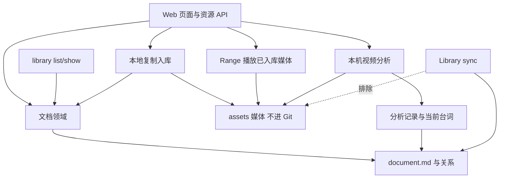

# Library 平级视频文档

- Issue：[#191](https://github.com/xforce-io/researcher/issues/191)
- L1：[概念方向与范围](https://github.com/xforce-io/researcher/issues/191#issuecomment-5627683299)，用户已 Approved。
- 状态：**Approved**
- 日期：2026-09-11
- 分支：`feat/191-library-video`

Issue 是验收依据，本文件是详细设计的唯一事实源。L1 未被本文件明确变更的范围内仍适用。

## 1. 背景

[#191](https://github.com/xforce-io/researcher/issues/191) 要把本地视频纳入 Library：入库、播放、本机分析出台词、按文字定位。#186 已将共同单元提升为平级文档，但类型集合与详情动作仍按文本/深读假设；Home 深读待办以「非 note」判断，video 若只加类型会误入 unread。#173 Library sync 排除媒体二进制。本设计在不拆独立导航区的前提下补上 video 的身份、存数、分析产物和详情主路径。

## 2. 名词解释

规范定义见[名词表](../glossary.md)。本次新增 **视频**、**台词**、**视频分析**、**媒体指纹**，并修订 **文档**（平级类型含 video）。

易混边界：

- 视频文档 ≠ 媒体文件：文档身份是 `documentId`；文件可缺失，身份与台词仍在。
- 台词 ≠ 自主笔记正文、≠ 深读产物：机器生成、依附视频、不进 Library 计数。
- 视频分析 ≠ 深读：无 Essence，不产生 read/unread，不进 Home 深读待办。
- 恢复同一媒体 ≠ 更换媒体：指纹一致才写回文件；不同文件拒绝，须新建文档。

## 3. 目标与非目标

目标：`docType=video` 与 paper、note 平级进入同一 Library；Web 完成 S1–S5（复制入库、播放、分析、搜索定位、失败保留、clone 后文本可搜并恢复同一媒体）；分析状态与深读状态分离；Library sync 同步元数据与当前台词，不传输媒体二进制。

非目标：独立视频区；URL 抓片；任意容器/编码；云转写；OCR；Essence 深读；剪辑导出；video 的文档批注、topic 关联/综合、台词人工编辑、删除/归档、产物历史浏览；把 mp4/webm、抽音缓存或模型文件纳入 Git；在原文档上换成不同媒体；本期 video 入库 CLI。

## 4. 能力

### 文档及附属内容契约

沿用 #186 文档共同字段。`LIBRARY_DOC_TYPES` 增加 `video`；`DOC_TYPES`（外部导入六种形式）不变。`video` 无 `canonicalSource`，不能经 import 创建。

| 内容 | 身份与信息 | 生命周期 |
|---|---|---|
| 视频文档 | `doc_<UUID>`，类型 video；标题默认取入库文件名去扩展名，可空；媒体指纹、字节数、入库文件名、MIME | 入库成功才成为 Library 条目；身份不随文件缺失而删除 |
| 已入库媒体 | `documents/<id>/assets/` 下的常规文件，路径由服务端生成 | 本地复制；不进 Git；缺失可按指纹恢复 |
| 视频分析记录 | 每次 `analysis_<UUID>`，归属 documentId；queued / running / done / failed | 重跑新增记录；失败不改上次成功产物 |
| 台词产物 | 当前成功分析的台词列表（可空）及时间信息 | 依附文档，不进 Library 计数；成功（含无语音）替换当前产物 |

支持深读的类型维持现状（外部六种形式）。note 与 video **都不**支持深读：`unread`/`read` 筛选不匹配它们；Home 深读待办、失败数不统计它们。不能只改前端隐藏。

| 动作 | 外部材料 | 自主笔记 | 视频 |
|---|---|---|---|
| Library 浏览、类型筛选、详情 | 支持 | 支持 | 支持 |
| 导入 URL/arxiv | 支持 | 不提供 | 不提供 |
| 深读 / unread | 支持 | 不提供 | 不提供 |
| 编辑正文 | 不提供 | 支持 | 不提供 |
| 文档批注、topic 关联/综合 | 既有范围 | 本期不提供 | 本期不提供 |
| 选择本地视频入库 | 不提供 | 不提供 | 支持 |
| 播放、视频分析、搜台词、点句定位 | 不提供 | 不提供 | 支持 |
| 按媒体指纹恢复文件 | 不提供 | 不提供 | 支持 |

动作由领域校验，HTTP 对不支持动作返回 422。导入接口不得用 `docType=video` 绕过。

### 入库与媒体

本期只接受同时满足的文件：扩展名为 `.mp4` 或 `.webm`，且 `Content-Type` 为 `video/mp4` 或 `video/webm`；体积 ≤ 2 GiB。其它组合一律拒绝，**不创建文档**。不探测编码是否为 H.264；浏览器无法播放或分析链无法抽音，归分析/播放失败，不回溯删除文档。

入库：用户选择文件 → 服务端写入该文档 `assets/` 临时名 → 计算 **媒体指纹**（文件字节 SHA-256）与字节数 → 原子写入 `document.md` → 才算发布。任一步失败：不出现可打开的 Library 条目；残留临时文件不作为资源。标题取原文件名去掉最后一个扩展名，超过 200 个 Unicode 码点则截断；空标题展示 `Untitled video`，不把该占位写入字段。

同一指纹在同一 workspace **不去重**：两次添加是两条文档（用户可能对同一文件做不同分析意图）。同一次入库请求的重试按 mutationId 去重，不复制第二条。

### 视频分析产物

分析对象是已入库媒体，不是用户原路径。运行时依赖为 workspace 本机 PATH 上的 `ffmpeg` 与 `mlx_whisper`（若无后者则 `whisper`）。缺依赖时播放仍可用，分析入口说明缺什么，不改走云端。实现须在失败信息中写明实际调用的命令名；不得在未修订本文件的情况下扩大到其它转写服务。

一次分析分配 `analysis_<UUID>`。终态：

- `done` 且至少一句有效台词：当前产物为该列表。
- `done` 且无有效台词：成功空产物，界面固定文案 `No speech detected`（中文说明可用「未检测到语音」）；这是成功，可替换当前产物。
- `failed`：记录原因；**当前产物仍是上一份成功产物**（含成功空）。从未成功则仍为未分析。

有效台词：`text` trim 后非空，且 `end > start`，时间为秒。无效句丢弃；丢光则按成功空处理。分析成功后，对非中文 `text` 生成本期简体**中文台词**写入同句可选字段 `zh`；翻译失败或未配置密钥时分析仍成功，只是没有 `zh`。不保留分析历史浏览入口；磁盘上可留历次记录供调试，UI 只暴露当前产物与最新一次失败。

### 当前句

只在**当前可见**台词（完整列表或搜索命中）中，当播放时间 `t ∈ [start, end)` 时标示该句。多句同时覆盖时取 `start` 最大者，再并列取稳定更小 id。间隙、片尾、或 `t` 只落在已筛掉的句上：无当前句高亮。点句将 `currentTime` 设为该句 `start`，允许误差 ±1s。

### 4.1 UI/UX

**信息架构**：仍是 Workspace / Library / Topics，不新增视频导航。详情仍为 `/library/documents/:documentId`。类型筛选增加 `video`，与 All 及原七类并列，共八类。Web 默认 Unlinked；video 无 topic 关联，出现在 Unlinked 不表示待综合。`type=video` 且 status 为 unread/read 时显示无结果，不改筛选。元数据搜索仍只扫标题/标签/来源标识，**不搜台词**；台词搜索只在视频详情内。

**总览**：`＋ Add` 增加 `Add video`。列表来源列为 `—`。状态列不使用 unread/read：

| 列表状态 | 条件 |
|---|---|
| Saved | 媒体在、无进行中分析、无待展示失败 |
| Analyzing | 存在 queued/running 分析 |
| Failed | 最新分析 failed（即使仍有上次成功台词） |
| Missing | 媒体文件不在 |

无标题显示 `Untitled video`。移动端仍压缩为同一列表，不另建页。

**添加入口**：文件选择，提交中禁用重复提交并显示入库中。失败留在入口并说明原因，Library 不出现该条。成功进入该文档详情。关闭/Escape 不留下半成品。

**详情**：共同框架（返回 Library、标题、类型、更新时间、中央区、支持动作）。动作仅 Analyze（媒体在且运行时允许时）或 Restore media（媒体缺失）。不展示空的 Essence、批注、topic、Edit。

桌面宽度下，顶栏与薄页头（返回、标题、Analyze/状态）之下是**剩余视口双栏工作台**，不是 `max-width` 居中的单栏长文：左栏为播放器（可限高）；右栏为台词工作区。右栏内搜索与命中计数/prev/next **固定不滚**，台词列表 `min-height: 0; overflow: auto`，只在该栏滚动，长列表不得把整页撑成文档流。媒体缺失时 Restore 占左栏播放槽，右栏台词仍可读可搜；点句/跳转/分析在缺失时解释，不假装已定位。视口宽度低于约 **900px** 时两栏叠成一列，仍是同一套 markup。

播放器播已入库文件，须支持 Range。

台词表：未分析给出 Analyze；分析中禁用重复提交并显示进行中；成功有词显示列表，每句英文下展示中文台词（无 `zh` 则只显示原文）；成功无语音显示 `No speech detected`；失败在保留旧列表（若有）上方显示错误和重试。搜索为台词栏内子串，匹配 `text` 与 `zh`，大小写不敏感，带命中计数与 prev/next（在当前过滤结果中循环并把命中滚进台词栏可视区）；无命中显示空结果，不清空底层产物。清空搜索恢复筛选前全部句。播放时当前句按 §4 规则高亮，并 **play-follow** 把该句垂直中心对齐到台词栏可视区中线（列表两端不够居中时贴顶或贴底）。用户在台词栏滚动、滚轮或触摸滑动后暂停自动跟随（高亮仍随播放移动）；点句或 prev/next 命中后恢复跟随。

**恢复**：仅文件选择。指纹一致：写回 assets 且 documentId 不变，台词不重跑。指纹不一致：拒绝，原文案与产物不变，不创建新文档。

| 状态 | 用户可见行为 |
|---|---|
| 空 Library | 可 Add video |
| 入库中 | 禁用重复提交，未完成前列表无该条 |
| 入库失败 | 说明原因，无新文档 |
| 未分析 | 可播放，台词区给分析入口，不假装有转写 |
| 分析中 | 可继续播已缓冲内容；分析不可再点 |
| 成功有台词 | 列表、搜索、点句 ±1s、可见区间高亮 |
| 成功无语音 | `No speech detected`，不是失败 |
| 分析失败 | 原因可读；旧成功产物仍在；可重试 |
| 无搜索命中 | 空结果；底层台词仍在 |
| 间隙/片尾/筛掉句上 | 无当前句高亮 |
| 媒体缺失 | 可读可搜台词；播、跳、分析不可用并说明；提供恢复 |
| 恢复被拒 | 说明不是同一媒体；记录不变 |
| 恢复成功 | 同一 ID，原台词可再定位 |
| 详情不存在 | 404，返回 Library |
| 不支持动作 | 422，不靠隐藏按钮代替 |

现有英文 UI 延续英文。键盘：搜索、点句、恢复焦点在控件上；不新增全局剪辑快捷键。

**Home**：文档总数含 video。深读待办/失败/unread 不含 video。创建菜单与 Library 相同，含 Add video。热榜仍只论文。

## 5. 思路与折衷

选择「平级 video + 本地 assets 复制 + 分析产物独立于深读 + 指纹恢复」。

放弃 `other` 与独立视频区：主路径必须可筛选、可验收。放弃把台词写入 note 正文：与「用户维护、机器不覆盖」冲突。放弃复用 `reads/` 与 Essence：避免 unread 语义污染。放弃只存原路径：S1 要求移动原文件后仍播入库副本。放弃媒体进 Git：体积与 #173 一致。放弃云 ASR。放弃指纹不同时覆盖：时间轴不能套到另一份视频上。

入库格式只锁 mp4/webm：覆盖本期验收夹具与常见下载，避免「任意格式」无界。分析模型不在本文件点名权重文件，只锁本机 CLI；换服务须改设计。

CLI 本期只把 video 纳入 `library list/show` 与类型筛选，不提供入库/分析命令；S1–S5 以 Web 为准。

## 6. 架构



分层：Web 负责选择文件、播放、分析进度和台词交互；文档领域负责类型、动作、指纹和「当前产物」选择；存储负责 `document.md` 原子发布与分析记录；分析是可替换本机命令；sync 只提交白名单文本。

**主路径**：校验 schema → 复制媒体并算指纹 → 写入文档 → 详情播放 → POST 分析 → 成功产物可见 → 点句 seek；搜索只过滤可见集；sync 带走 document.md 与当前台词 JSON。

**失败路径**：格式/体积/复制失败 → 无文档。缺 ffmpeg/whisper → 可播、分析说明原因。分析进程失败 → 当前产物不变。媒体缺失 → 可读可搜，播/跳/分析拒绝并给恢复。恢复指纹不符 → 拒绝。sync 不 stage `assets/`。

不新增数据库、云服务或常驻分析守护进程；分析由 serve 请求触发、绑定 localhost。不改 `delivery.mode`。

## 7. 模块

| 边界 | 责任 |
|---|---|
| 文档领域与存储 | `video` 类型、入库发布、指纹、当前分析产物选择、动作校验 |
| Web 路由与详情 | Add video、播放 Range、分析任务、台词搜索/当前句、恢复 |
| Web 总览与 Home | 八类筛选、video 状态列、深读统计排除 video |
| 本机分析命令 | 抽音 + 转写，产出台词 JSON；失败写原因 |
| Library sync | 白名单增加分析 JSON；继续排除 assets |
| CLI | list/show/类型筛选包含 video；不新增入库/分析子命令 |

不要求按表新建包名。函数命名归实现 PR。

## 8. API/CLI

沿用 documents 根。新增与收紧如下。GET 页面 HTML，资源 `Accept: application/json` 为 JSON。

| 方法与路径 | 契约 |
|---|---|
| GET `/library` | type 增加 `video` |
| GET `/library/documents` | 同上；video 的 source 为 —；状态字段不出现 unread/read |
| POST `/library/documents/videos` | multipart 本地文件 + mutationId；成功 201 返回 id/url；格式/体积错误 400；超限 413；失败不创建文档 |
| GET `/library/documents/:documentId` | video 详情含媒体是否存在、当前分析状态、当前台词摘要 |
| GET `/library/documents/:documentId/media` | 已入库媒体，支持 Range；缺失 404（文档仍 200） |
| POST `/library/documents/:documentId/analyses` | 触发分析，202 + analysisId；媒体缺失或类型不符 422；缺运行时 503 且不把文档标失败产物覆盖；进行中重复不同请求 409 |
| GET `/library/documents/:documentId/analyses/:analysisId` | 状态、错误、若 done 则台词；校验归属 |
| GET `/library/documents/:documentId/cues` | 当前成功产物；从未成功 404；成功空为 `[]` 且标记 noSpeech |
| POST `/library/documents/:documentId/media/restore` | 文件 + 指纹校验；一致 204；不一致 409 且不改存储 |

reads / annotations / links / edit 对 video 返回 422。import 的 docType 仍仅六种外部形式。

列表 type：`all` 或八种类型。status 集合不变。Web 缺省 unlinked，JSON/CLI 缺省 all。未知 type/status 400。

**CLI**

- `researcher library list --type video` 与 Web 同筛选。
- `researcher library show <id>` 可读 video 元数据与当前台词；不输出媒体二进制。
- 不新增 `library add-video` / `analyze`。

## 9. 边界

- 新建 ID 为 `doc_<UUID>`；路径仅服务端构造；拒绝穿越与符号链接，沿用安全 ID 规则。
- 媒体与分析文件不得通过任意相对路径下载。
- 同源 localhost；存在 Origin 的写请求只接受当前服务源。不新增鉴权。
- 文档写入与分析创建走现有跨进程领域锁；不能只靠按钮禁用。
- 台词搜索不进入 Library 总览 `q`。
- 不自动把 video 链到 topic，也不因分析完成改 Unlinked。

## 10. 迁移/兼容/回滚

无旧视频数据，不做资料迁移。schema 仍为 2；新增类型与文件，不升主版本。

Library sync 白名单在 #186 基础上增加：

```text
documents/<documentId>/analyses/<analysisId>.json
```

（记录与台词可同文件或按实现拆成同目录仅 `.json`。）仍排除 `assets/`、抽音缓存、模型、锁、临时文件。`document.md` 可含媒体指纹字段，随现有白名单同步。

回滚程序：停止写入 video 后恢复旧二进制。旧程序 `parseLibraryDocType` 不识 `video` 时，须保证 **整库列表不 500**：无法解析的文档按已有损坏/跳过处理，不丢其它类型。video 的 assets 与 analyses 成为未引用文件，不自动删除。新程序再上线后同一 `documentId` 仍应能读指纹；媒体若还在本地则可播。

## 11. 测试计划

层级仅 E2E / Integration / Unit。夹具用秒级 mp4：一份含清晰语音，一份无语音；禁止用 56 分钟样片做门禁。

### E2E

- **S1**：Add video 受支持文件 → 入库完成 → 移动原文件 → 列表与 type=video 再打开；新增 1 条，播放的是副本。
- **S2**：有语音 → 播、分析、点句，≥1 句且 currentTime 在 start±1s。无语音 → 分析完成并显示 No speech detected，不出现失败、不伪造句。
- **S3**：搜索 → 仅命中且数量等于子串命中 → 点句 ±1s → 播放落入可见 `[start,end)` 仅该句高亮；间隙或筛掉句上无高亮；清空后数量等于筛选前。
- **S4**：已有成功产物 → 注入分析失败 → 台词原文与时间不变 → 修复后重试成功并更新产物；documentId 不变，新增 0 文档。
- **S5**：`workspace sync --library` 后另目录 clone → 无媒体时可读可搜台词，受管 Git 路径无 assets 媒体 → 不同文件恢复 409 且产物不变 → 同一文件恢复后点句 ±1s；同一 ID，新增 0 文档。

### Integration

入库失败无 document.md；发布前崩溃不出现半成品条目。重启后身份与当前产物一致。sync 含 document.md 与分析 JSON，不含 assets。Home/unread 不含 video。对 video 调 reads/import/annotations 为 422。

### Unit

`parseLibraryDocType('video')`；mp4/webm 与拒绝规则；指纹相等/不等；台词子串；可见集上 `[start,end)` 当前句（含重叠、间隙、筛掉）；无语音 vs failed 分类。

## 12. 开放问题

N/A。格式集合、指纹算法、当前句区间、sync 白名单与 CLI 范围已在上文锁定。

## 13. 关联

- [#191](https://github.com/xforce-io/researcher/issues/191) 验收 S1–S5；[L1](https://github.com/xforce-io/researcher/issues/191#issuecomment-5627683299)
- #186 平级文档、动作校验、损坏文档跳过
- #173 Library sync 与二进制排除
