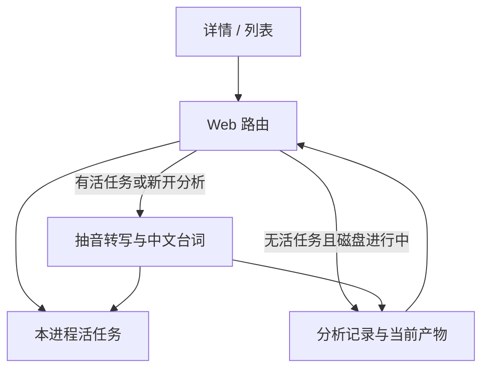

# 视频分析必须进入终态

- Issue：[#193](https://github.com/xforce-io/researcher/issues/193)
- L1：[进行中只表示活任务](https://github.com/xforce-io/researcher/issues/193#issuecomment-5646511336)，用户已 Approved。
- 状态：**Draft**
- 日期：2026-09-12
- 分支：`feat/193-video-analysis-terminal-state`

Issue 是验收依据，本文件是详细设计的唯一事实源。#191 未被本文件明确变更的范围内仍适用。

## 1 背景

[#193](https://github.com/xforce-io/researcher/issues/193) 修的是 #191 上线后的生命周期漏洞：Analyze 会新起一轮分析；最新记录停在 `queued`/`running` 时，列表/详情一直 Analyzing，按钮禁用或 409。转写已成功、中文台词挂住或 serve 进程内任务消失时，记录不会进入终态，上次成功台词仍在但入口被锁。

#191 已规定重跑、失败不覆盖上次成功、翻译失败仍可 `done`。本文件只补「进行中」与终态收口，不重开视频文档模型。

## 2 名词解释

规范定义见[名词表](../glossary.md)。本次新增 **活任务**。视频、台词、中文台词、视频分析沿用名词表，不抄。

易混边界：

- 活任务 ≠ 磁盘 `queued`/`running`：后者只是记录，进程退出后可以没有对应执行。
- 活任务 ≠ tmp 抽音/转写文件：残留文件不证明分析仍在跑。
- 中文台词缺失 ≠ 分析失败：转写已得到有效台词时，没有 `zh` 仍是 `done`。

## 3 目标与非目标

目标：Web 上 Analyze 仍表示重跑；进行中只在有活任务时出现；无活任务的过期记录不能锁住上次成功产物；转写成功后中文台词不得把整次停在进行中。对应 #193 S1–S2。

非目标：把 Analyze 改成只看旧结果；取消、进度、分析历史；新状态枚举；独立 worker / 云 ASR；跨进程活任务表或租约文件；台词人工编辑；改标题（#194）。

## 4 能力

沿用 #191 的 `queued | running | done | failed`。本文件收紧「进行中」判定，并规定过期记录与中文台词阶段如何进入终态。

**活任务**：由触发该次分析的 serve 进程持有。该 `analysisId` 的执行尚未结束则为活；进程退出后该进程的活任务集为空。CLI 与其它进程不持有活任务。

**收口**：用户可见的 Web 读/写一旦碰到某文档最新分析是 `queued`/`running` 且无活任务，须先把该记录写成 `failed`，`lastError` 固定为 `Analysis interrupted`，再继续响应。不覆盖上次成功产物（`currentVideoProduct` 仍是最近一次 `done`）。不在 serve 启动时全库扫描。

收口发生在至少这些路径：Library 列表（HTML 与 JSON）、视频详情 GET、`GET .../analyses/:analysisId`、`POST .../analyses`。轮询状态的 GET 必须能把过期记录变成终态，否则详情会一直 Analyzing。

**中文台词阶段**：抽音与转写成功之后、写入 `done` 之前。单次翻译请求上限 **20 秒**；整段中文台词阶段合计上限 **120 秒**。任一到期视为翻译失败：已译出的 `zh` 可保留，未译的没有 `zh`，分析仍 `done`。未配置密钥或翻译抛错，同样 `done` 且可以没有 `zh`。抽音/转写失败仍是 `failed`，不因翻译规则改写。

测试夹具可注入立即超时或失败的翻译，门禁不等待 120 秒。

### 4.1 UI/UX

信息架构、详情双栏、搜索/点句、恢复，沿用 [191 §4.1](./191-library-video.md)。本期只改进行中与失败如何出现。

列表状态（修订 #191「Analyzing = 存在 queued/running」）：

| 列表状态 | 条件 |
|---|---|
| Saved | 媒体在、无活任务、最新记录不是 `failed` |
| Analyzing | 该文档存在活任务 |
| Failed | 最新分析 `failed`（含收口后的中断；即使仍有上次成功台词） |
| Missing | 媒体文件不在 |

详情：

- 有活任务：横幅 `Analyzing…`，Analyze 禁用；若已有成功台词，台词区仍显示上次产物。
- 无活任务：禁止显示进行中。最新 `failed` 时错误可读（中断为 `Analysis interrupted`），Analyze 可点（媒体在且运行时可用）。
- 最新 `done`：无失败横幅；有词显示列表，无语音 `No speech detected`。

Analyze 仍是重跑，不改成确认框。不做进度、取消、历史。英文 UI。

| 状态 | 用户可见行为 |
|---|---|
| 未分析 | 可播放，台词区给分析入口 |
| 分析中（有活任务） | 可继续播；Analyze 不可再点；旧成功台词若有则仍可见 |
| 成功有台词 | 离开 Analyzing；列表/搜索/点句可用；无 `zh` 只显示原文 |
| 成功无语音 | `No speech detected`，不是失败 |
| 分析失败 / 中断 | 原因可读；旧成功产物仍在；Analyze 可再点 |
| 过期 queued/running 被打开 | 不得保持 Analyzing；按失败/中断展示并允许再点 |

## 5 思路与折衷

选择「活任务在 serve 进程内 + 读/写时惰性收口 + 翻译超时仍 `done`」。

放弃只看磁盘 latest：这正是本 bug。放弃新增 `interrupted`：列表/详情已有 Failed。放弃先英文 `done` 再异步补 `zh`：第二条生命周期，超出 S1/S2。放弃启动全库扫描：打开列表/详情即可满足验收，避免 serve 启动扫盘。放弃跨进程租约文件：不新开协调存数；CLI 不发起分析，过期记录在 Web 收口后 CLI 才能看到 `failed`。

## 6 架构

分层：Web 持有活任务并在用户可见路径上收口；文档存储只保存四态记录与当前产物；分析命令仍是本机抽音+转写；中文台词是分析成功路径上的可选步骤，不能单独把记录留在进行中。

**主路径**：已有成功台词 → POST 分析（无活任务）→ 写入 queued/running 并登记活任务 → 202 → 详情 Analyzing → 转写成功 → 中文台词在时限内完成或放弃 → `done` → 离开 Analyzing，台词可搜可点，Analyze 可再点。

**失败路径**：

- 真有活任务且不同 `mutationId` → 409，不新开。
- 抽音/转写失败 → `failed`，当前产物不变。
- 翻译超时/失败 → `done`，可无 `zh`。
- 磁盘进行中但无活任务 → 收口为 `failed` + `Analysis interrupted`，当前产物不变；POST 随后可新开。
- 前端轮询 GET 碰到过期记录 → 返回 `failed`，页面可 reload。

不新增数据库、守护进程或外部队列。

## 7 模块

| 边界 | 责任 |
|---|---|
| serve 活任务 | 登记/结束本进程内的 `analysisId`；进程退出即空 |
| Web 读/写调和 | 列表、详情、分析 GET/POST 先按 §4 收口再展示或 409 |
| 分析记录存储 | 仍只存四态；`failed` 不改上次 `done` 产物 |
| 中文台词 | 时限内尽量补 `zh`；到期或失败不挡 `done` |
| CLI | 不新增 analyze；list/show 读磁盘，收口前过期记录可能仍像进行中 |

不要求新建包名。

## 8 API/CLI

路径沿用 #191。语义收紧：

| 方法与路径 | 本期契约 |
|---|---|
| GET `/library`、GET `/library/documents` | video 的 Analyzing **仅**当该文档有活任务；读列表时收口过期记录 |
| GET `/library/documents/:documentId` | 详情 Analyzing 仅活任务；过期记录先收口再渲染 |
| POST `/library/documents/:documentId/analyses` | 有活任务且 `mutationId` 相同 → 202 原 id；有活任务且不同 → 409；无活任务即使磁盘 `queued`/`running` → 先收口，再开新分析（已终态且 `mutationId` 相同 → 返回该终态，不开新任务） |
| GET `/library/documents/:documentId/analyses/:analysisId` | 返回该记录；若其为 `queued`/`running` 且无活任务，先收口再返回 `failed` |

其它 video 路径不变。不新增 HTTP 资源。

**CLI**：不新增 `library analyze`。`library list/show` 不持有活任务，不在本期做跨进程收口。

## 9 边界

- 只动视频分析进行中/终态与 409。不改入库、播放、搜索/点句、媒体恢复、深读。
- 不把 tmp 或模型文件当作活任务。
- 同源 localhost 写请求规则沿用 #191。
- 分析创建仍走现有领域锁；不能只靠按钮禁用。
- 本机已卡住的记录不在部署时批量改写；第一次被上述 Web 路径读到即收口。

## 10 迁移/兼容/回滚

无 schema 主版本变更，无资料迁移脚本。已有 `queued`/`running` JSON 保持原样，直到被 §4 收口写成 `failed`。

回滚：恢复旧二进制后，磁盘 `running` 会再次被当成进行中（本 bug 复现）。新程序再上线后，打开列表或详情即按本文件收口。Library sync 白名单不改。

## 11 测试计划

层级仅 E2E / Integration / Unit。分析夹具继续用秒级 mp4，禁止用长样片做门禁。翻译超时用注入，不等待 120 秒。

### E2E

- **S1**：已有至少 1 句成功台词 → 点 Analyze → 看到 Analyzing → 等到离开 Analyzing；台词可搜可点，Analyze 可再点；documentId 不变，新增 0 条文档。转写成功但中文台词缺失时不得停在进行中。
- **S2**：已有成功台词，磁盘写入无活任务的 `queued`/`running` → 打开详情 → 非永久 Analyzing、上次台词可搜可点、错误可读 → 再点 Analyze 能启动（202 新 id 或可观察的新一轮）；documentId 不变，新增 0 条文档。

### Integration

- 无活任务时 POST 不以 409 挡住新分析。
- 有活任务且不同 `mutationId` 仍 409。
- GET `analyses/:id` 对过期 `running` 返回 `failed` 且 `lastError` 为 `Analysis interrupted`。
- 翻译超时/失败在转写成功后落 `done`，`cues` 为当前转写，不覆盖规则仍适用于真正的 `failed`。

### Unit

- 进行中只认活任务。
- 过期 `queued`/`running` 收成 `failed` 后，`currentVideoProduct` 仍是上次 `done`。
- 列表状态：有活任务才是 Analyzing；收口后是 Failed。

## 12 开放问题

N/A。时限、收口路径与 409 语义已在 §4 / §8 钉死。

## 13 关联

- [#193](https://github.com/xforce-io/researcher/issues/193) 验收 S1–S2
- L1：https://github.com/xforce-io/researcher/issues/193#issuecomment-5646511336
- [#191](https://github.com/xforce-io/researcher/issues/191) / [L2](./191-library-video.md)：重跑、失败不覆盖、翻译失败仍可成功；本文件修订其「Analyzing = 磁盘 queued/running」与 409 的进行中判定
- #194 改标题：另案
