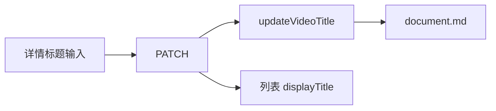

# 视频文档显示标题可改

- Issue：[#194](https://github.com/xforce-io/researcher/issues/194)
- L1：Issue 评论
- 状态：**Draft**
- 日期：2026-09-12
- 分支：`feat/194-video-title`

Issue 是验收依据。#191 / #193 未被本文件变更的范围仍适用。

## 1 背景

[#194](https://github.com/xforce-io/researcher/issues/194) 要让已入库视频能改**显示标题**。当前标题只在入库时从文件名截取，详情无保存入口。

## 2 名词解释

见[名词表](../glossary.md)。不新增术语。显示标题即文档 `title`，不是媒体 `filename`、不是台词。

## 3 目标与非目标

目标：S1 改标题后列表与详情一致且可重载；S2 超过 200 个 Unicode 码点拒绝、原标题保留、合法重试成功。documentId 不变，仍 1 条文档；媒体与台词不变。

非目标：改入库文件名/指纹/assets；台词编辑；删除/归档；换媒体；批量改名；note 式正文编辑器；动 #193 分析状态机。

## 4 能力

`PaperLibrary.updateVideoTitle({ id, title, expectedRevision, mutationId })`：校验 `title` 为 string 且码点 ≤ 200（与 note 标题同一上限）；空字符串合法。非 video 422；未知 404；revision 不符 409；相同 mutationId 且标题相同则幂等返回。成功：写入 `title`，`revision+1`，不改 `media`、不改 analyses。

### 4.1 UI/UX

详情 `h1` 旁（或替代为）标题输入 + Save。英文 UI。错误显示在标题控件旁（超长：title exceeds 200 code points）。保存成功后列表与详情均为新标题。Analyze / 播放 / 台词区布局不变。不做 `/edit` 整页。

| 状态 | 行为 |
|---|---|
| 有标题 | 输入框为当前 title |
| 空标题 | 输入空；展示名 Untitled video |
| 保存成功 | 详情与列表新标题 |
| 超长 | 不写盘；原标题仍在；错误可读 |
| 保存中 | 禁用重复提交 |

## 5 思路与折衷

只改 `title`。放弃显示名旁路字段。放弃复用 note PATCH 的必填 `body`（会把 video 拖进笔记编辑器）。放弃改文件名。

## 6 架构

**主路径**：详情 PATCH → 写 title → GET 详情/列表为新标题。

**失败路径**：超长 400 field=title；非 video 422；revision 409；原 title 与 media/cues 不变。

## 7 模块

| 边界 | 责任 |
|---|---|
| 存储 | updateVideoTitle |
| Web PATCH | `/library/documents/:id` 对 video 只收 title |
| 详情 UI | 输入 + Save，不进 note editor |

## 8 API/CLI

| 方法 | 契约 |
|---|---|
| PATCH `/library/documents/:documentId` | video：JSON `{ title, expectedRevision, mutationId }`；200 `{ id, title, revision, updatedAt, url }`。缺字段 400。title 非 string 或 >200 码点 400 `field=title`。非 video 且当 note 用则仍走 note 契约（note 仍要 body）。 |
| GET 详情/列表 | `displayTitle` / `<h1>` 为新 title；空则 Untitled video |

不新增 CLI 改名命令。`library show` 读磁盘标题即可。

## 9 边界

不改 media.filename / sha256 / bytes。不改 analyses。同源写请求规则沿用。

## 10 迁移/兼容/回滚

无 schema 升级。旧文档无改名记录。回滚：旧二进制详情无 Save，磁盘 title 若已改仍保留（数据不回滚）。

## 11 测试计划

- **HTTP S1**：add video → PATCH 新标题 → GET JSON 与 HTML 列表/详情含新标题；cues/media 字段不变；文档数 1。
- **HTTP S2**：201 码点 400 且 title 未变 → 合法 PATCH 200 新标题。
- **Unit**：>200 抛错；空 title 合法。

## 12 开放问题

N/A

## 13 关联

- #194；#191 入库标题；#186 note 标题上限；#193 不在本期
