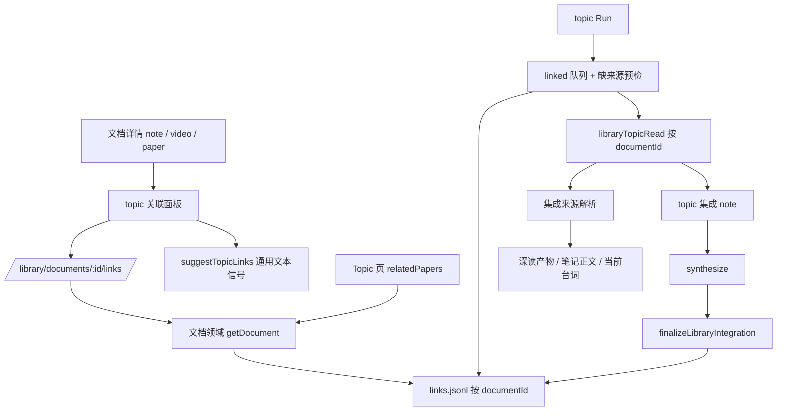

# 自主笔记与视频的 topic 关联与集成

- Issue：[#197](https://github.com/xforce-io/researcher/issues/197)
- L1：[概念方向与范围](https://github.com/xforce-io/researcher/issues/197#issuecomment-5650191113)，用户已 Approved
- 状态：**Draft**
- 日期：2026-09-13
- 分支：`feat/197-note-video-topic-link`

Issue 是验收依据，本文件是详细设计的唯一事实源。L1 未被本文件明确变更的范围内仍适用。

## 1. 背景

[#197](https://github.com/xforce-io/researcher/issues/197)：Library 里 paper、自主笔记、视频是平级文档，但只有 paper 详情有 Topic link 面板。`/library/documents/:id/links` 对另两类一律 422（`src/web/server.ts:469-474`、`:975`），绕过 UI 也关联不上。

阻塞不在存储层。`links.jsonl` 按 documentId 索引、无 docType 字段与校验（`src/library/store.ts:576-615`、`src/library/model.ts:60-68`），`summarizeDocument` 已对任意类型算出关联数与列表状态（`src/web/discovery.ts:283-307`），推荐算法只吃通用文本信号（`src/web/topic-link-suggest.ts:166`）。真正 paper-only 的是三处：详情页渲染按类型早退（`src/web/server.ts:536-554`）、link API 门禁、以及 topic 侧按**外部来源 ref + 深读产物**寻址的消费路径（`src/commands/run.ts:208-215`、`src/pipeline/library_topic_read.ts:43-46`、`:150-169`）。

#191 曾把「video 的文档批注、topic 关联/综合」列为本期非目标（`docs/design/191-library-video.md:26`）。本文件修订其中的 topic 关联与综合部分；**文档批注仍不在范围内**。

## 2. 名词解释

规范定义见[名词表](../glossary.md)。本次新增 **topic 关联** 与 **集成来源** 两条。

易混边界：

- topic 关联 ≠ 已集成：关联是用户意图，集成是 Run 把该文档写进 landscape 后才有的事实（`integrations` 行）。解除关联不删除既有集成历史（沿用 `runLibraryUnlink` 语义）。
- 集成来源 ≠ 深读产物：深读产物只是外部材料的集成来源；自主笔记用正文，视频用台词。给这两类补深读路径不在范围内。
- 视频的集成来源 ≠ 视频分析动作：集成只读**当前台词产物**，不触发分析。

## 3. 目标与非目标

目标：S1 自主笔记详情可关联并在 topic 页可见；S2 视频同样且媒体与台词不变；S3 两类都有 ≤3 条推荐且点击只填充不写入；S4 多关联与解除与 paper 行为一致；S5 有台词的视频被 Run 集成为 1 篇 topic note、内容取自台词、重跑不重复；S6 无台词的视频不产出空集成 note 且原因可辨。

非目标：不给两类文档做深读；不改 `links.jsonl` 结构、媒体指纹与视频分析；不做文档批注；不做批量关联与 Home 批量推荐；不做推荐的 LLM 排序；不把视频详情改成笔记编辑器；不做两类文档的删除/归档；不把台词纳入 Library 总览 `q`（#191 §9 保持）。

## 4. 能力

### 4.0 动作矩阵修订

修订 `docs/design/191-library-video.md:50-57` 表中 topic 关联一行，其余行不变：

| 动作 | 外部材料 | 自主笔记 | 视频 |
|---|---|---|---|
| topic 关联、解除、多关联 | 支持 | **支持（本期新增）** | **支持（本期新增）** |
| 被 topic Run 集成 | 支持 | **支持（本期新增）** | **支持（本期新增）** |
| 文档批注 | 既有范围 | 不提供 | 不提供 |
| 深读 / unread | 支持 | 不提供 | 不提供 |
| 删除/归档 | 既有范围 | 不提供 | 不提供 |

不支持的动作仍由领域校验并对 HTTP 返回 422；不靠前端隐藏按钮代替。

### 4.1 topic 关联契约（文档级）

领域读写不变：`upsertLink` / `listLinks` / `unlink` 已按 documentId，无 docType 门禁。改的是**语义前置**：关联路径的存在性校验从 `getPaper` 换成 `getDocument`。

`getPaper` 保留 paper 语义（`src/library/store.ts:170-174` 不动），继续服务深读、`loadLibraryPaper` 与 discover。凡是「只需要文档身份」的地方不得再用它。

| 位置 | 现状前置 | 改为 |
|---|---|---|
| `handleLinks` 入口（`server.ts:975`） | `noteActionBlocked` 返回 422 | 移除该门禁；未知文档仍 404 |
| `runLibraryLink`（`commands/library.ts:167`） | `getPaper`，错误 `unknown paper id` | `getDocument`，错误 `unknown document id` |
| `runLibraryUnlink`（`:205`） | 同上 | 同上 |
| `runLibraryIntegrate`（`:181`） | 同上 | 同上 |
| Topic 页 `relatedPapers`（`discovery.ts:615-621`） | `getPaper`，非 paper 静默丢弃 | `getDocument` + `summarizeDocument`，任意类型都列出 |

`deletePaper` 仍用 `getPaper`：删除不在范围内，两类文档的 DELETE 保持 422。

### 4.2 集成来源解析

`libraryTopicRead` 按文档类型解析集成来源，而不是一律要求深读产物：

| 文档类型 | 集成来源 | 集成 note 正文 | 无来源 |
|---|---|---|---|
| 外部材料（有 `canonicalSource`） | 深读产物（`ensureLibraryRead` 生成或复用现有） | `libraryReadEmbedBody`，现状不变 | 深读失败即该阶段失败，现状不变 |
| 自主笔记 | 文档正文 | 正文原样嵌入 | 正文 trim 后为空 |
| 视频 | 当前台词产物（`lib.currentCues`） | 每句一行 `[mm:ss] 原文`，有 `zh` 时次行缩进附中文台词 | 从未成功分析、或成功空产物（`noSpeech`） |

集成 note 的落盘位置、编号、frontmatter、`pendingLibraryIntegration` 与 `finalizeLibraryIntegration` 的时点全部沿用现状（`src/pipeline/library_topic_read.ts:50-75`、`:79-110`）：仍然只在 synthesize 证明 landscape 变了之后才记 integration。

视频集成来源只读当前产物，**不触发视频分析**，也不因集成改动 analyses 或媒体。

### 4.3 候选寻址与队列预检

`pickLinkedLibraryCandidate` 的返回值从来源 id 改为 **documentId**（`src/commands/run.ts:208-215`）。选取顺序仍是「关联到本 topic、未集成、`createdAt` 最早」；不再偏好 arxiv——偏好来自「返回来源 id 时必须挑出可解析的一条」，按 documentId 寻址后这个理由消失。

**预检**：候选必须已具备集成来源，否则不进队列。这样既不静默集成错的东西，也不会让一条缺台词的视频永久卡住整个 topic。Run 结束态在现有两种之外新增一种：

| 队列状况 | outcome | stdout |
|---|---|---|
| 无待集成、且该 topic 从无集成 | `nothing-to-run`（现状） | 现状文案 |
| 无待集成、且该 topic 有过集成 | `all-integrated`（现状） | 现状文案 |
| 有待集成但**全部**缺集成来源 | `blocked-queue`（新增） | 逐条列出 documentId、类型、缺什么，并给出补救动作 |
| 有可集成候选 | 进入 read 阶段 | 现状文案改为「文档」口径 |

队列里同时有可集成与缺来源的文档时：集成可集成的那条，并在 stdout 列出被排除的文档与原因——排除必须可见，不能静默。

`classifyEmptyLinkedQueue`（`run.ts:220-233`）本身已与类型无关，只需承接新增的 `blocked-queue` 判定。

### 4.4 RunContext 不变式

`ctx.addSourceId` 语义不变，继续服务三条来源寻址路径：discover 命中（`src/pipeline/discover_triage.ts:112`）、`researcher add`（`src/commands/add.ts:36`）、`researcher read`（`src/commands/read.ts:29`）。新增 `ctx.addDocumentId` 服务 linked 队列。

**不变式**：进入 read 阶段时两者**恰有一个**被设置。`libraryTopicRead` 入口断言，违反即 throw，不做择一优先。

外部材料经 documentId 进入时，`libraryTopicRead` 解析出 `canonicalSource.id` 后**回填** `ctx.addSourceId`，使 `package` 写 `seen.jsonl` 的行为与今天完全一致（`src/pipeline/package.ts:181-184`）。自主笔记与视频没有来源 id，因此不写 `seen.jsonl`——它们不是 discover 命中，去重本来就靠 `integrations`。`package.ts:22` 的前置放宽为「`addSourceId` 或 `addDocumentId` 之一」。

按 documentId 进入时不再 `upsertPaper`（文档已在库），`identifiers` 与 `sources` 不变；discover 路径仍 upsert 以创建新来源文档。

### 4.5 推荐信号

不改 `suggestTopicLinks` 签名。澄清 `PaperSuggestSignals.notes` 的语义为「附加文本片段」，三类文档各自喂入：

| 文档类型 | title | tags | notes | readExcerpt |
|---|---|---|---|---|
| 外部材料 | 现状 | 现状 | 文档批注正文，pinned 优先（现状） | 深读产物摘录（现状） |
| 自主笔记 | 文档标题 | 文档标签 | 文档正文 | 无 |
| 视频 | 显示标题 | 文档标签 | 当前台词按句拼接，含 `zh`，截断至 8 000 字符（与 thesis 摘录同量级，`discovery.ts:548`） | 无 |

显隐规则沿用 `shouldShowTopicSuggest`（`views.ts:961-967`）：未关联主题的推荐为空则不出 Suggest 外壳；已关联 ≥2 或已有集成则隐藏；单关联降级为弱化的 `Also consider`。点击推荐仍**只填表单不写入**，`TOPIC_SUGGEST_JS` 契约不变。

### 4.6 UI/UX

关联面板复用 #97 的 markup 与 class（`.topic-link-panel` / `.topic-link-form` / `.topic-suggest` / `.topic-link-submit`，`views.ts:996-1043`）。class 名不得改——现有 CSS 与测试依赖它们。面板输入从 `LibraryPaperDetailView` 收窄为文档级视图：documentId、`topics`、该文档的 `links`、`integrations`、`topicSuggestions`。

**自主笔记详情**（`renderNoteReader`，`views.ts:836`，单栏）：正文之后、`Edit` 动作之前，依次是 `Linked topics` 列表与 Topic link 面板。仍不展示 Essence、深读、批注。

**视频详情**（`renderVideoReader`，`views.ts:753`）：面板放在 `<header class="video-head">` 内、Analyze 动作与状态之下，**不进 `.video-workbench`**。#191 §4.1 锁定了工作台是剩余视口双栏、台词栏 `min-height: 0; overflow: auto` 且只在该栏滚动；把面板塞进两栏会破坏该契约。窄屏（<900px）随页头自然堆叠，仍是同一套 markup。媒体缺失时面板照常可用——关联与媒体在不在无关。

不为这两类文档新建右侧栏。paper 的 `paper-inspector` 是承载深读、批注、Essence 的容器，两类文档没有这些内容，只为放一个面板造一个空侧栏没有收益。

| 状态 | 用户可见行为 |
|---|---|
| 无可用 topic | 面板显示 `All available topics are linked.`（沿用现状文案） |
| 未关联 | 主按钮 `Link topic` |
| 已关联 ≥1 | 主按钮 `Link another topic`；已关联项可 Update rationale、可解除 |
| 点击推荐 | 只填入表单，状态行提示需再次提交 |
| 视频无台词 | 面板照常可用；推荐无台词信号时可能为空，不报错 |
| 提交中 | 禁用重复提交 |
| 未知文档 | 404 |
| 不支持动作（批注、深读、删除） | 仍 422 |

英文 UI 延续英文。

## 5. 思路与折衷

选择「topic 关联提升为文档级 + 集成来源按类型解析 + 队列按 documentId 寻址 + 缺来源预检排除」。

放弃给自主笔记与视频补深读路径：与 #186「用户维护、机器不覆盖」和 #191「视频分析不是深读、不产生 unread」都冲突，且会把 Essence 语义污染到没有外部材料的文档上。

放弃把 `addSourceId` 整体改成判别联合：它被 add / read / discover / package 四条路径与十余个测试文件写死（`src/pipeline/package.ts:22`、`:91`、`src/pipeline/read.ts:37`、`src/pipeline/library_add_register.ts:27` 等）。本期改成「两个字段 + 恰有一个的硬断言」，用断言而不是优先级兜底来防止双写；统一表示留给后续。

放弃「缺来源就整个 Run 失败」：队列按 `createdAt` 取最早一条，一条缺台词的视频会让该 topic 每次 Run 都失败在同一处，用户无法推进其它文档。改为预检排除 + 排除原因可见 + 全部缺来源时 `blocked-queue`。

放弃「缺来源就静默跳过」：跳过必须在 stdout 列出，否则用户会以为集成的是自己关联的那条。

放弃为两类文档新建右侧栏（见 §4.6）。放弃把台词写进集成 note 时丢掉时间戳：保留 `[mm:ss]` 才能回溯到视频位置，这是台词相对普通正文的唯一增量信息。

## 6. 架构

分层：Web 只负责面板与提交；文档领域负责身份、动作校验与关联读写；集成来源解析是 read 阶段内按类型分派的一层，不外泄到 Web；Run 只拿 documentId。

**主路径**：详情页选 topic → POST links → Topic 页与详情都显示关联 → Run 预检取到该文档 → 解析集成来源 → 写集成 note → synthesize 改动 landscape → 记 integration → 下次不再取。

**失败路径**：未知文档 404；不支持动作 422；缺集成来源的文档不进队列并在 stdout 说明；全部缺来源时 `blocked-queue` 且新增 0 篇集成 note；synthesize 未改 landscape 则不记 integration（现状不变）。

不新增数据库、端点、常驻进程，不改 `delivery.mode`，不改视频分析链。

## 7. 模块

| 边界 | 责任 |
|---|---|
| 文档领域与存储 | 关联路径改用 `getDocument`；`getPaper` 仍守 paper 语义 |
| Web 详情与面板 | 面板收窄为文档级输入，note / video 各自布局接入 |
| Web link 路由 | 移除 links 上的类型门禁，其余动作门禁不动 |
| Topic 页 | `relatedPapers` 按文档重建 |
| 推荐接线 | 三类文档各自组装通用文本信号 |
| Run 队列 | documentId 寻址 + 缺来源预检 + `blocked-queue` |
| read 阶段 | 集成来源按类型解析；外部材料回填 `addSourceId` |
| package 阶段 | 前置放宽；无来源 id 时不写 `seen.jsonl` |
| CLI library link/unlink/integrate | 接受任意文档 id |

不要求按表新建包名；函数命名归实现 PR。

## 8. API/CLI

沿用 documents 根，**不新增端点**。

| 方法与路径 | 契约 |
|---|---|
| GET `/library/documents/:documentId/links` | 对 note / video 不再 422；返回该文档的关联行，字段不变 |
| POST 同上 | 对 note / video 不再 422；请求体仍为 `surfaceType=topic` + `topic`/`surfaceId` + 可选 `rationale`；未知文档 404 |
| DELETE `/library/documents/:documentId/links/topic/:topicId` | 同上放开；既有集成历史不删 |
| GET `/library/documents/:documentId` | note / video 详情 HTML 增加 `Linked topics` 与关联面板；JSON 响应字段不变 |
| GET `/t/:slug` | 相关文档列出任意类型；`pendingRelatedCount` 含两类文档 |
| reads / annotations / import / edit / DELETE 文档 | 对 note / video 仍 422，本文件不放开 |

**CLI**

- `researcher library link <documentId> --topic <path>`、`unlink`、`integrate` 接受任意文档 id；未知 id 报 `unknown document id`。
- 不新增子命令。

**Run 输出**：`blocked-queue` 为新增结束态；现有 `nothing-to-run` / `all-integrated` 文案由「paper」口径改为「文档」口径。

## 9. 边界

- `links.jsonl` 结构与 `LinkRecord` 字段不变，无 schema 升级。
- 关联写入沿用现有跨进程领域写锁；不靠按钮禁用代替。
- 同源 localhost 写请求规则不变；不新增鉴权。
- 不改媒体指纹、`assets/`、analyses、视频分析运行时依赖。
- 台词只作为集成来源与推荐信号被读取，仍不进 Library 总览 `q`。
- 集成来源解析不发起网络请求，不调 LLM。

## 10. 迁移/兼容/回滚

无 schema 变更，无资料迁移：`links.jsonl` 早已按 documentId 存，历史行不需要改写。

回滚到旧二进制后：note / video 的关联行仍在 `links.jsonl`，旧 Topic 页用 `getPaper` 会静默丢弃它们（**不 500**），旧 `/links` 对它们仍 422，旧 Run 的 `pickLinkedLibraryCandidate` 用 `getPaper` 会跳过它们——降级是安全的，但数据不回滚，集成 note 与 integration 行保留。

新旧程序交替运行时，同一 topic 的队列在旧程序下看不到两类文档，可能出现「新程序说有待集成、旧程序说 all-integrated」；这是回滚期的已知差异，不做兼容层。

## 11. 测试计划

层级仅 E2E / Integration / Unit。视频夹具沿用 #191 的秒级 mp4（一份含语音、一份无语音）；禁止用长样片做门禁。

### E2E

- **S1**：建 1 条自主笔记、workspace ≥2 topic → 详情关联 1 个 topic → 刷新详情 → 打开该 topic 页；详情与 topic 页都显示该关联；`links.jsonl` 新增 1 条且 documentId 一致。
- **S2**：入库 1 条视频 → 详情关联 → 刷新 → topic 页；关联可见，`media` 与当前台词字段不变，视频文档仍 1 条。
- **S3**：笔记有正文、视频有台词 → 两者详情的推荐 ≤3 条 → 点一条推荐 → `links.jsonl` 不变且表单已填 → 再提交才写入。
- **S4**：笔记已关联 1 个 topic → 关联第 2 个 → 解除第 1 个；两步后详情与 topic 页状态与操作一致，最终该 documentId 只剩 1 条关联；既有集成行不受解除影响。
- **S5**：topic 关联 1 条有台词的视频且未集成、discover 关闭 → 跑 Run → 集成 note 新增 1 篇且正文来自台词（含 `[mm:ss]`）、不含深读产物标记 → 再跑一次 → 新增 0 篇。
- **S6**：topic 只关联 1 条未分析的视频 → 跑 Run → 集成 note 新增 0 篇，outcome 为 `blocked-queue`，stdout 含该 documentId 与缺台词的原因。

### Integration

队列里同时有无台词视频与有正文笔记时：集成笔记，stdout 列出被排除的视频及原因，新增 1 篇。外部材料经 documentId 集成后 `seen.jsonl` 与改造前一致；自主笔记与视频集成后不写 `seen.jsonl`。同时设置 `addSourceId` 与 `addDocumentId` 时 read 阶段 throw。Topic 页 `pendingRelatedCount` 含两类文档。对两类文档调 reads / annotations / import / edit / DELETE 仍 422。

### Unit

`pickLinkedLibraryCandidate` 返回 documentId 且按 `createdAt` 取最早、排除已集成与缺来源者；`classifyEmptyLinkedQueue` 三态判定；集成来源解析对三类文档与「正文空」「无当前产物」「`noSpeech` 空产物」的分类；台词转集成来源文本的时间戳格式与 `zh` 缺失；`summarizeDocument` 在 topic 页口径下对 note / video 的 `canonicalId` 为 `—`。

现有测试保全：`tests/web/views.test.ts:833` 起的 paper 侧边栏断言、`tests/web/topic-link-suggest.test.ts:155-181`、`tests/web/server.test.ts:629-701` 必须仍通过；`tests/commands/run-linked-candidate.test.ts` 的期望随 documentId 寻址更新，但「已集成则不再取」这条语义不得丢。

## 12. 开放问题

N/A。集成来源解析规则、缺来源的处理、寻址不变式、面板落位与名词表新增均在上文锁定。

## 13. 关联

- [#197](https://github.com/xforce-io/researcher/issues/197) 验收 S1–S6；[L1](https://github.com/xforce-io/researcher/issues/197#issuecomment-5650191113)
- #97 关联面板与推荐（复用其 markup 与显隐规则）
- #191 平级视频文档、台词与视频分析；本文件修订其 topic 关联/综合非目标
- #186 平级文档与自主笔记定位
- #140 Run 默认只 integrate linked 队列
