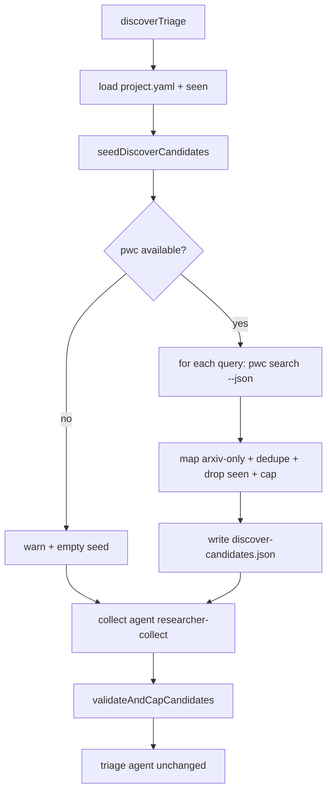

# 【pipeline】Discover 用 pwc search 做宿主种子

- Issue: 待开
- 状态: Draft
- 最后更新: 2026-08-03

## 1. 背景

Paper-mode discover 的 collect 阶段由 milkie agent（`researcher-collect`）通过 `run_command` 自行检索，再写出 run-local `discover-candidates.json`。宿主只做 schema 校验、去重与 cap（#117）。

实测与架构后果：

- 检索路径不确定：agent 可能乱搜、重复搜、浪费 `max_tool_calls: 12`。
- 宿主侧唯一学术 API 是 arXiv **按 id 取元数据**（`src/sources/arxiv.ts`），**没有**按 query 搜索。
- `project.yaml` 的 `sources[].queries` 是声明式意图，却没有确定性执行层。

[huggingface/pwc-cli](https://github.com/huggingface/pwc-cli) 提供匿名只读 CLI：`pwc search QUERY --json` 返回稳定 `{"schema_version","data"}`，适合做宿主种子。它不能替代 triage / deep-read / synthesize / package，只增强 collect 的底盘。

## 2. 名词解释

- **seed**：宿主在 collect agent 之前，用 `pwc search` 写入的初始 `discover-candidates.json`（或等价内存结构后落盘）。
- **collect 补缺**：现有 `researcher-collect` 在已有种子上补充 abstract、覆盖 thesis/landscape 缺口；不重复同一 query。
- **软降级**：`pwc` 不在 PATH、调用失败或结果不可用时，跳过种子并 warning，collect 行为与改造前一致。

## 3. 设计目标与非目标

- **目标**：
  - paper-mode discover 的主查询路径确定性：`sources[].queries` → `pwc search --json`。
  - 降低 collect 无效 tool 调用，提高候选 JSON 的稳定产出率。
  - `pwc` 为 **optional** 外部二进制；缺失不破坏现有 discover。
  - 保持 #117 的 collect/triage 隔离、handoff schema、下游 Seen/选题语义。
- **非目标**：
  - 不用 pwc 替换 triage、Library、read、synthesize、package、feed/x-inbox。
  - v1 不做 `related` / `lineage` / `trending` / `benchmark`。
  - 不把 pwc 打成 npm/Python 依赖；不内嵌 Papers with Code HTTP client（v1 只 exec CLI）。
  - 不扩展 deep-read 到无 arXiv id 的 PwC 条目（v1 直接丢弃无 arxiv_id 的结果）。
  - 不改 `triaged.json` schema，不改默认 `run` 是否 discover（仍由现有 `--discover` / 队列逻辑决定）。

## 4. 能力与功能设计

### 4.1 UI / UX

N/A。无新页面。CLI/Web 仍只看到一个 `discover` stage。日志可出现一行 seed 摘要或 soft-degrade warning。

### 4.2 用户可见行为

| 场景 | 行为 |
|---|---|
| PATH 有 `pwc`，paper discover 且有 real queries | 宿主先 seed，再 collect，再 triage |
| 无 `pwc` / 全 query 失败 | warning，空种子，collect 与现网一致 |
| feed / x-inbox | 不触达 |
| 无 discover（无 `--discover` 或走 Library 队列） | 不触达 |

## 5. 设计思路与折衷

候选：

1. **只改 prompt，要求 agent 优先 `pwc`**：改动最小；稳定性不保证，tool budget 仍可能被浪费。放弃作为主方案。
2. **宿主全量替换 collect**：最确定；丢掉 thesis/landscape 动态补缺与非 PwC 弹性，与 #117「agent 有界搜集」冲突。放弃。
3. **宿主 seed + agent 补缺（选择）**：主路径确定；agent 只补缺；软降级保留零硬依赖。与 #117 文件交接模型兼容。

v1 只做 **queries → search**：

- 放弃 seed_papers → related/lineage：调用与映射更复杂，留 v2。
- 放弃 trending/recent：易引入与 thesis 无关热门文，增加 triage 噪声。
- 只保留有 **arxiv_id** 的结果：下游 deep-read / Library 主路径仍是 arXiv；discover 里非 arXiv deep-read 仍可能被降级，v1 不扩大该裂缝。

## 6. 架构设计

### 6.1 逻辑分层



### 6.2 核心业务流程

1. `loadCollectedCandidates` 在调用 collect agent **之前**尝试 seed（若 path 上已有合法 candidates 文件则仍直接采用，与现逻辑一致——resume/partial 优先）。
2. Seed：
   - 解析 `project.yaml` 中带 `queries` 的 paper sources（至少 `kind: arxiv`；其他 kind 若仅有 keyword queries 也可纳入同一 search，v1 不跑 citation follow）。
   - 截断 query 列表上限（默认前 **5** 条，稳定顺序：yaml 声明序）。
   - 每 query：`pwc search <q> --limit 10 --mode hybrid --json`（argv 数组，无 shell）。
   - 解析 `schema_version` + `data`；从 `data.results` / `data.items` / 顶层 list 取行（与 pwc-cli `_rows` 兼容）。
   - 映射为 `DiscoverCandidate`；无 arxiv_id、无 title、无 abstract、无 url 的行丢弃。
   - 过滤 `seen`；跨 query 按 canonical `arxiv:` id 去重；全局 seed cap **20**（为 agent 留到 30 的空间）。
   - 若至少 1 条：写 `discover-candidates.json`，`search_summary` 标明 host pwc seed（query 列表与条数）。
   - 若 0 条：不写假成功文件（或写空 candidates + summary 说明 seed 空——实现选一种并单测；**推荐写空文件 + summary**，让 collect 明确「已尝试 seed」）。
3. Collect prompt 注入 seed 状态：
   - 已有 N 条种子、路径、摘要；
   - **禁止**对已 seed 的同一 query 再跑 `pwc search` / 等价 arXiv 搜索；
   - 优先：补缺 abstract（`pwc paper info`）、thesis/landscape 缺口的**新** query；
   - 无 pwc / 空种子：保持现有 budget 指令。
4. 现有 `validateAndCapCandidates`（cap 30）→ triage → Seen/选题 **不变**。

## 7. 模块设计

| 模块 | 职责 |
|---|---|
| `src/sources/pwc.ts` | `isPwcAvailable`；`pwcSearch(query, opts)`；exec + JSON 解析 + typed errors |
| `src/pipeline/discover_seed.ts` | 读 yaml queries、调 pwc、map/dedupe/cap、写 handoff、返回 seed 报告 |
| `src/pipeline/discover_triage.ts` | 在 collect 前调 seed；把 seed 报告编进 collect prompt values |
| `prompts/stage-discover-collect.md` | seed 感知指令与反重复搜索约束 |
| `methodology/02-source.md` + README | optional `pwc`；host seed 说明 |
| `tests/sources/pwc.test.ts` | 映射、可用性、坏 JSON、非零退出 |
| `tests/pipeline/discover_seed.test.ts` | query 截断、seen、dedupe、cap、软降级 |

不修改：`discover-candidates` zod schema 字段集、triage agent、package、Library identity。

## 8. API / CLI 设计

### 8.1 外部命令契约（pwc）

```text
pwc search <QUERY> --limit 10 --mode hybrid --json
```

成功 stdout：

```json
{"schema_version":"v1","data":{...}}
```

Exit：`0` ok，`2` 用法，`3` 网络，`4` 坏响应。宿主将 2/3/4 与 spawn 失败均视为 **该 query 失败**（软），不 fail 整个 discover。

可选探测：`pwc version`（available 检查可用 `which`/`pwc version` 一次缓存/进程内 memo）。

### 8.2 Candidate 映射

| pwc 字段 | discover candidate |
|---|---|
| `arxiv_id`（优先）或可解析的 arxiv 形 `id` | `id` = `arxiv:{bare}`（去版本后缀与现有 canonicalize 一致） |
| `title` | `title` |
| `abstract` | `abstract`（缺则该行丢弃，留给 agent `paper info` 补） |
| `url_abs` / `source_url` / 推导的 `https://arxiv.org/abs/{id}` | `url` |
| — | `source` = `"arxiv"` |

无 arxiv_id → **丢弃**（v1）。

### 8.3 Researcher 对外 CLI

无新子命令、无新 flag。文档声明 optional PATH 依赖 `pwc`。

环境变量（可选，实现时可加，保持最小）：

| 变量 | 默认 | 含义 |
|---|---|---|
| `RESEARCHER_PWC_BIN` | `pwc` | 可执行文件 |
| （可不做）seed limit/query cap | 10 / 5 / 20 | 先常量，避免配置爆炸 |

## 9. 边界考虑

- **安全**：`execa` argv，query 不进 shell；pwc 输出当 untrusted data，经 zod 再进 triage。
- **超时**：单次 search 建议 30–60s；总 seed 阶段应远小于 collect 的 15min。
- **并发**：v1 串行 per query，避免打爆公开 API；与 arxiv throttle 哲学一致。
- **幂等 / resume**：若 `discover-candidates.json` 已合法存在，不覆盖（保持现 collect 短路）。
- **部分失败**：单 query 失败不影响其他 query；全失败 = 空种子 + warning。
- **兼容**：无 pwc 时除 stderr/log warning 外行为同现网。
- **feed 模式**：`resolveRunSourceMode` 为 feed 时根本不进 discover seed。

## 10. 迁移 / 兼容 / 回滚

- 无数据迁移。
- 已初始化 topic 只需更新 prompts/methodology（随包升级或 `methodology install` 策略）。
- 回滚：去掉 seed 调用与 prompt 段落即可；seen/triaged 历史不受影响。

## 11. 测试计划

- **Unit**
  - pwc JSON → candidates 映射（含版本后缀 arxiv id）。
  - 无 arxiv_id / 无 abstract 丢弃。
  - seen 过滤、跨 query 去重、cap 20、query 截断 5。
  - `pwc` 缺失、exit 3、坏 JSON → 软降级不抛到 stage 失败。
- **Integration**
  - PATH 上 fake `pwc` 脚本返回固定 JSON → seed 文件通过 `parseDiscoverCandidates` → collect prompt 含 seed 摘要且含「勿重复 query」。
  - 无 fake pwc → seed 空 + collect 仍可被 stub 写出 candidates（现有路径）。
- **E2E**
  - 默认 CI 不打真网。
  - 可选 `PWC_E2E=1`：真 `pwc search` 一次非空（本地/手工）。

可判定成功：

1. 有 stub pwc 时，discover collect 前 disk 上已有 ≥1 条合法 arxiv candidate。
2. 无 pwc 时，discover 不因 seed 失败。
3. triage 输入 schema 与改造前相同。

## 12. 开放问题 / 决策记录

| 决策 | 选择 | 理由 |
|---|---|---|
| 执行归属 | 宿主 seed + agent 补缺 | 稳定性与弹性平衡 |
| 缺 pwc | 软降级 | 不把外部 CLI 变硬依赖 |
| v1 命令面 | 仅 `search` | 最小可测切片 |
| 无 arxiv_id | 丢弃 | 对齐下游 deep-read |
| seed 空是否写文件 | 写空 candidates + summary | collect 可区分「未 seed」与「seed 零命中」 |
| 配置 knobs | 先常量 | YAGNI |

开放（实现前可默认，不必再议）：

- seed 的 `search_summary` 语言：跟随 `meta.language` 或固定英文机器摘要 —— **跟随 language**。

## 13. 关联

- 前置设计：`docs/design/117-discover-context-isolation.md`
- 相关代码：`src/pipeline/discover_triage.ts`、`src/config/discover-candidates.ts`、`prompts/stage-discover-collect.md`、`templates/milkie-researcher-collect.md`
- 外部：https://github.com/huggingface/pwc-cli
- Issue / PR：待开

---

# Out of scope（再强调）

- `pwc paper related|lineage|trending|benchmark`
- 宿主 HTTP 直连 paperswithcode.co（绕过 CLI）
- 将 pwc Markdown 全文当 deep-read 正文
- semantic_scholar `follow` 的宿主实现
- 改变 `--discover` opt-in 策略
